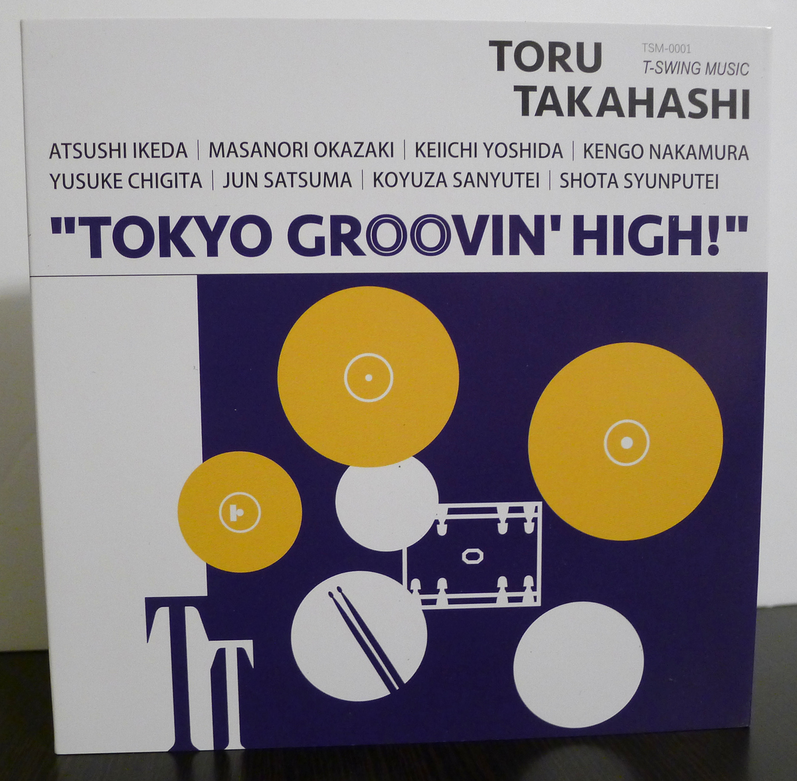
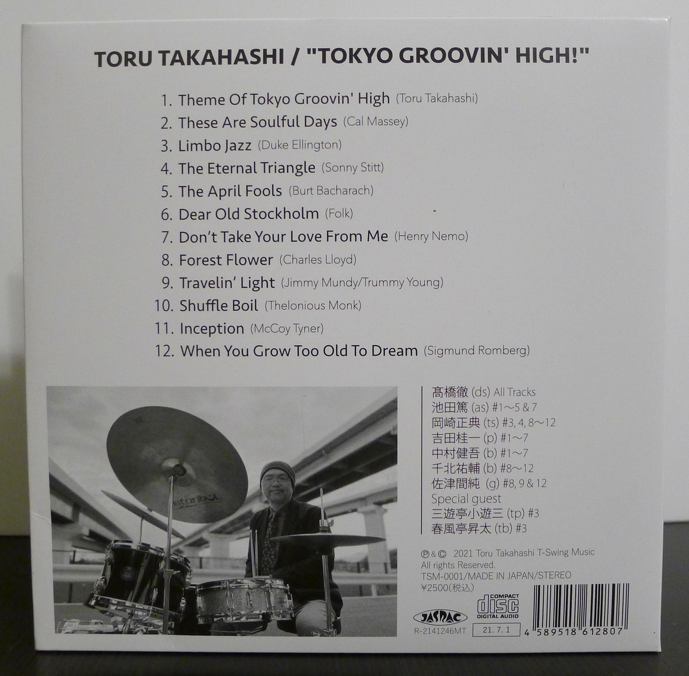
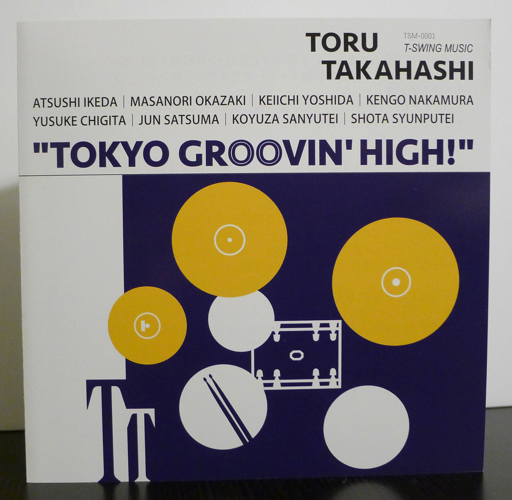
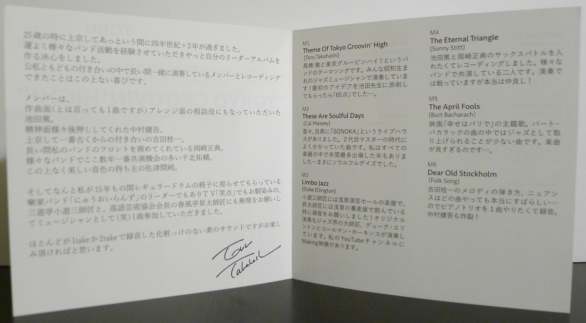
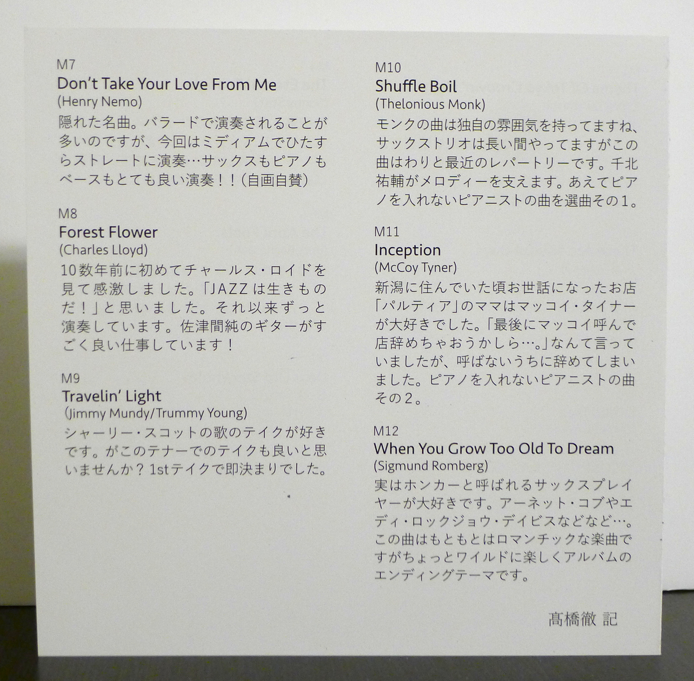

+++
title = "Toru Takahashi: Tokyo Groovin’ High!"
author = ["Brian McCrory"]
publishDate = 2025-12-06
keywords = ["hara-dairiki-trio-youve-changed"]
tags = ["Toru Takahashi 高橋徹", "Atsushi Ikeda 池田篤", "Masanori Okazaki 岡崎正典", "Keiichi Yoshida 吉田桂一", "Kengo Nakamura 中村健吾", "Yusuke Chigita 千北祐輔", "Jun Satsuma 佐津間純", "Koyuza Sanyutei 三遊亭小遊三", "Shota Shunputei 春風亭昇太"]
categories = ["albums"]
draft = false
[cover]
  image = "toru-takahashi-tokyo-groovin-high-460.jpeg"
  relative = true
+++

Drummer Toru Takahashi’s debut album is _Tokyo Groovin’ High_, a 2021 release that presents addictive jazz bebop favorites performed by long-time musical partners and friends. This is a drummer-led album where Takahashi makes the most of arranging the musicians in various forms. With three different rhythm sections, the drummer plays with quartet and quintet forms, the classic piano trio, and even a septet featuring two special guests known for _rakugo_ storytelling performances and television appearances.

Of course, the title track, Takahashi’s own “Tokyo Groovin’ High”, leads the charge and captures the spirit of the original tune it is based on, the well-known bebop contrafact “Groovin’ High” by Dizzy Gillespie. It’s good straight-ahead jazz played by musicians who clearly love the music and are having fun playing it together.

Driven by Takahashi’s expert drumming, the ultra-in-the-pocket swing and groove continues with songs including “These are Soulful Days”, “Dear Old Stockholm”, and “When You Grow Too Old To Dream”. Some atmospheric departures are featured through Ellington’s Afro-Caribbean “Limbo Jazz”, the New Orleans parade-style (Poinciana) groove on “The April Fools”, and the beautiful ballad “I’m Traveling Light”.

The musicians’ love for classic jazz, decorated and fun arrangements, and jazz improvisation shine, as the bebop spirit lets loose as the temperature goes up on several songs as well. The band burns on Sonny Stitt’s Rhythm Changes “The Eternal Triangle”, with a alto vs. tenor sax battle. In the same vein, Thelonious Monk’s leaping “Shuffle Boil” and McCoy Tyner’s high-octane “Inception” are fiery highlights, both played in a raw chord-less trio formation to capture that lean, wild Sonny Rollins trio sound.



## Liner Notes {#liner-notes}

_(Translated from Toru Takahashi’s original Japanese liner notes.)_

It’s been a quarter century and three years since I came to Tokyo at the age of 25 and it went by in a flash. I’ve been fortunate to have been a part of many live band experiences, and now I have finally decided to make my own album as a leader. Nothing has brought me more joy than being able to record with these musicians who I have been with so long, both professionally and personally.

These members are: Atsushi Ikeda, who helped with composition on one song and consulting with me on the arrangements.
Kengo Nakamura, who supported me spiritually in many ways.

Keiichi Yoshida, who is my oldest friend since I moved to Tokyo.
Masanori Okazaki, who has been fronting my band for such a long time.
Yusuke Chigita, who has been playing with me the most over the last several years in various bands.

Jun Satsuma, who has the most beautiful tone.

The master Koyuza Sanyutei, my good friend from the TV variety program “Shoten” and leader of the _Hanashika_ (rakugo) storyteller band, “New Oirans”, where I was allowed to occupy the drum seat for fifteen years, to my surprise.

The master Shota Shunputei, president of the Rakugo Arts Association, who granted our impossible request to join as a musician (ha ha!) on one song.

Most songs were recorded in one or two takes with a raw, unpolished sound, and I sincerely hope you enjoy it.

_Toru Takahashi_

M1  
**Theme Of Tokyo Groovin' High**  
(Toru Takahashi)  

This is the theme song for Toru Takahashi and the “Tokyo Groovin’ High!” band. We’re all performing as jazz musicians born in the Showa era! When I asked Professor Ikeda to review my first idea, I received a score of 65 points...

M2  
**These Are Soulful Days**  
(Cal Massey)

Once upon a time, there was a live house called “Sonoca” in Meguro. This song was often played there during the days of the second owner. There was also a year when I had the most number of appearances in one year among all the instruments... Those were truly soulful days.

M3  
**Limbo Jazz**  
(Duke Ellington)

Backstage at Asakusa Engei Hall, I begged master Koyuza Sanyutei to record for me. And, I begged master Shota Shunputei to record while we were drinking at a soba shop in Asakusa! The original recording was also made by great masters of the jazz world, Duke Ellington and Coleman Hawkins. There’s a “Making Of” video on my YouTube channel.

M4  
**The Eternal Triangle**  
(Sonny Stitt)

We recorded this because I wanted a sax battle with Atsushi Ikeda and Masanori Okazaki. These two have played together in many bands. Although they do battle in the performance, they are honestly really good friends!

M5  
**The April Fools**  
(Burt Bacharach)

This is the title theme from the movie. Among Burt Bacharach’s songs, this one is rarely played in jazz. The song is just too good...

M6  
**Dear Old Stockholm**  
(Folk Song)

Keiichi Yoshida’s melodic sense and nuances are truly wonderful no matter what song he plays... so, I wanted to record one song as a piano trio. Kengo Nagamura is also explosive!

M7  
**Don’t Take Your Love From Me**  
(Henry Nemo)

A hidden gem. It’s often performed as a ballad, this here we play it medium tempo and entirely straight-ahead... The sax, piano, and bass give such a great performance!!! (Taking pride, if I can say so myself...)

M8  
**Forest Flower**  
(Charles Lloyd)

Over 10 years ago, I saw Charles Lloyd for the first time, and he left a deep impression on me. “Jazz is alive!” I thought. Since then, I’ve continued to play this song. Jun Satsuma does an amazing job on guitar!

M9  
**Travelin’ Light**  
(Jimmy Mundy/Trummy Young)

I like Shirley Scott’s take on this song. But, don’t you think this tenor take of this song is also great? It was decided in just one take.

M10  
**Shuffle Boil**  
(Thelonious Monk)

Monk’s songs have a unique feeling. Our sax trio is a long-running unit, but this song is a relatively recent addition to our repertoire. Yusuke Chigita supports the melody. Song selection 1 of “pianist’s songs that don’t include a pianist”.

M11  
**Inception**  
(McCoy Tyner)

When I was living in Niigata, the mama-san of the friendly shop “Parthia” really loved McCoy Tyner. She would say things like “I wonder if I should finally quit the shop and call McCoy...”. But, she ended up quitting before making that call. Song selection 2 of “Pianist’s songs that don’t include a pianist”.

M12  
**When You Grow Too Old To Dream**  
(Sigmund Romberg)

Honestly, I really love sax players that could be called “honkers”. Arnette Cobb, Eddie “Lockjaw” Davis, and so on... This song is originally a romantic tune, but it gets a little wild and fun here, serving as this album’s ending theme.

_Notes by Toru Takahashi_



## Tokyo Groovin’ High! by Toru Takahashi {#tokyo-groovin-high-by-toru-takahashi}

-   [Toru Takahashi](http://torutakahashi.com/) - drums
-   [Atsushi Ikeda](https://ameblo.jp/ats-music1963/) - alto sax (#1-5, 7)
-   [Masanori Okazaki](https://masanoriokazakisax.jimdofree.com/home/) - tenor sax (#3, 4, 8-12)
-   [Keiichi Yoshida](https://ameblo.jp/pianok10823/) - piano (#1-7)
-   [Kengo Nakamura](https://kengonakamura.com/) - bass (#1-7)
-   [Yusuke Chigita](https://yusukechigita.bandcamp.com/album/family-diary) - bass (#8-12)
-   [Jun Satsuma](https://junsatsuma.com/) - guitar (#8, 9, 12)
-   [Koyuza Sanyutei](https://ja.wikipedia.org/wiki/%E4%B8%89%E9%81%8A%E4%BA%AD%E5%B0%8F%E9%81%8A%E4%B8%89) - special guest trumpet (#3)
-   [Shota Shunputei](https://shunputei-shota.com/) - special guest trombone (#3)

Released in 2021 on T-Swing Music as TSM-0001.

_Japanese names: 高橋徹 Takahashi Toru 池田篤 Ikeda Atsushi 岡崎正典 Okazaki Masanori 吉田桂一 Yoshida Keiichi 中村健吾 Nakamura Kengo 千北祐輔 Chigita Yusuke 佐津間純 Satsuma Jun 三遊亭小遊三 Sanyutei Koyuza 春風亭昇太 Shunputei Shota_

## Audio and Video {#audio-and-video}

-   [“Tokyo Groovin’ High” (track #1 behind the scenes excerpt):](https://youtu.be/K-PuB1MKKsU)



-   [“Limbo Jazz” (track #3 live performance):](https://youtu.be/lCyH-_krmwA)



-   [“When I Grow Too Old To Dream” (track #12 behind the scenes excerpt):](https://youtu.be/Cluw26czxDY)



-   [Tokyo Groovin’ High! 2nd Set:](https://youtu.be/N5bBvlt-9LQ)



-   [Making of “Limbo Jazz”:](https://youtu.be/A-AiNoUAe9g)



-   Excerpt from track #7: “Don’t Take Your Love From Me” [mix #14](https://www.jazzofjapan.com/archive/audio/#mix-14)


