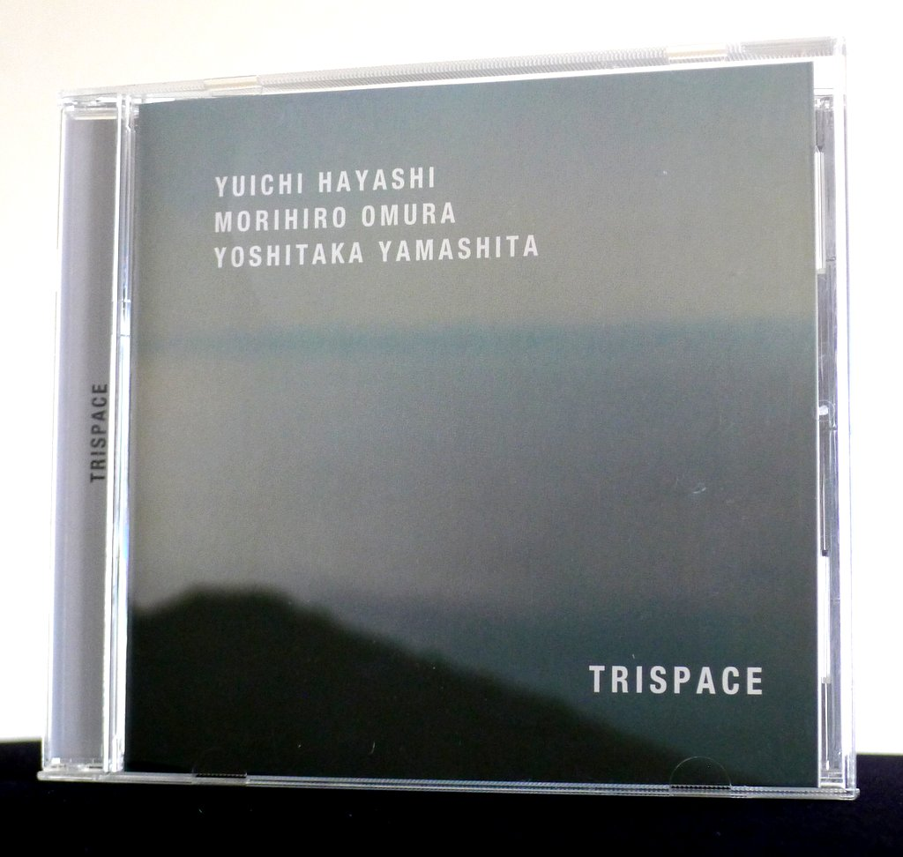
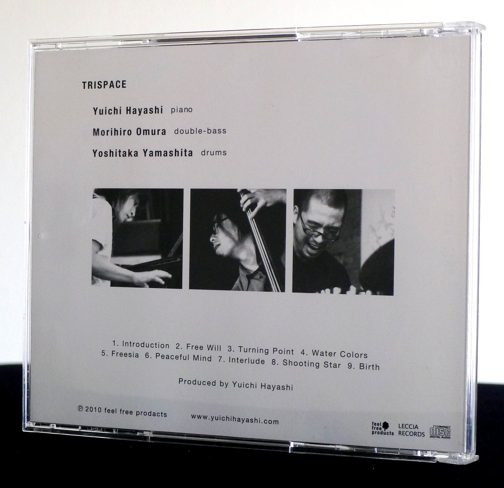
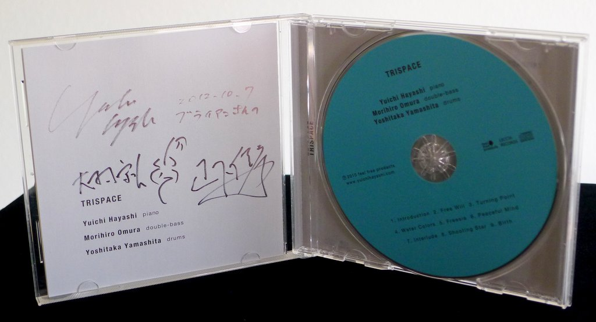
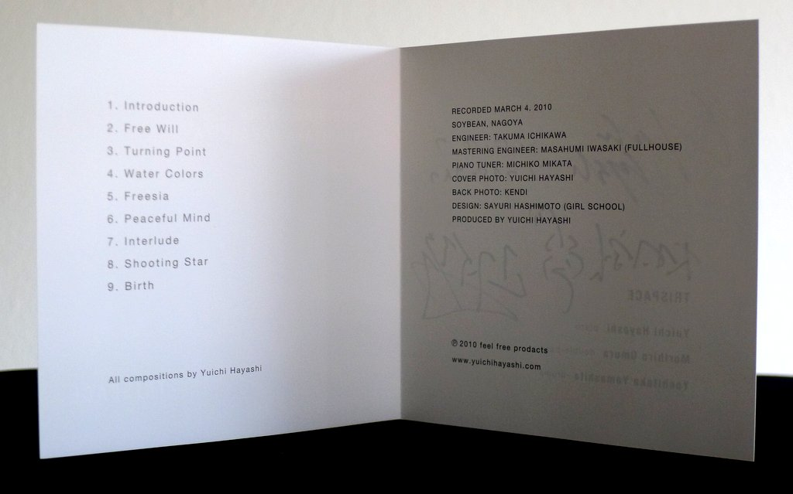

+++
title = "Trispace: Trispace"
author = ["Brian McCrory"]
publishDate = 2018-11-06
tags = ["Yuichi Hayashi 林祐市", "Morihiro Omura 大村守弘", "Yoshitaka Yamashita 山下佳孝"]
categories = ["albums"]
draft = false
[cover]
  image = "trispace-trispace-460.jpeg"
  relative = true
+++

Inspired by a modern, clean European jazz sound, the jazz piano trio Trispace on their debut 2010 album brings to mind modern jazz along the lines of Swedish jazz supergroup Esbjörn Svensson Trio (EST). Focused in concept, Trispace plays with delicate, beautifully recorded instruments, airy jazz-rock beats, and occasional odd-beat rhythmic structures that carry the listener along on comfortable musical journeys. Even the stylishly serene jacket design conveys the intended atmosphere, perhaps paying homage to the great modern jazz recordings from the ECM label visually as well as aurally.

Yuichi Hayashi’s piano takes center stage, with gentle melodies and pleasant lines of flowing improvisation. Morihiro Omura and Yoshitaka Yamashita, the double-bass and drums rhythm section, together build a solid groove framework over which the fluttering melodies catch the listener’s attention.

With nine original songs spanning jazz-rock, soft ballads, and a light EST and Bill Evans-style melodic sense, Trispace sets upon their path as a modern and inspired Japanese jazz trio.

## Trispace by Trispace {#trispace-by-trispace}

-   [Yuichi Hayashi](http://yuichihayashi.com/) - Piano, Composition
-   Morihiro Omura - bass
-   Yoshitaka Yamashita - drums

Released in 2010 on Leccia Records / feel free products as LRTR-0004.

_Japanese names: 林祐市 Hayashi Yuichi 大村守弘 Omura Morihiro 山下佳孝 Yamashita Yoshitaka_

## Audio and Video {#audio-and-video}

-   [Trispace on “Free Will”, the second track on this album:](https://youtu.be/OI2Rg7KwrZk)



-   Excerpt from track #6: “Peaceful Mind” [mix #4](https://www.jazzofjapan.com/archive/audio/#mix-4)


