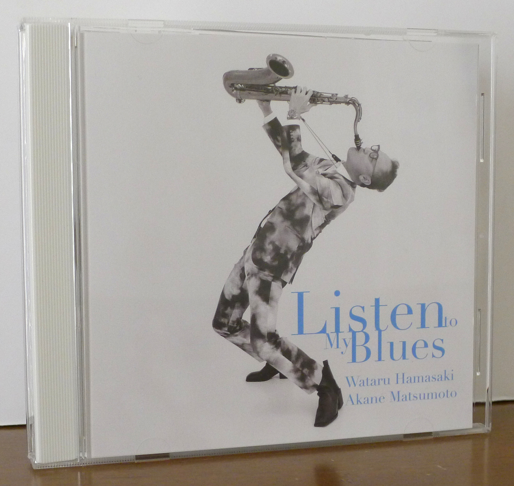
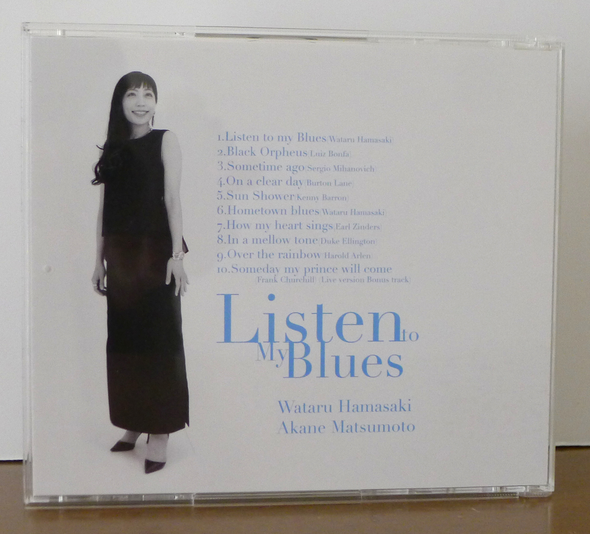
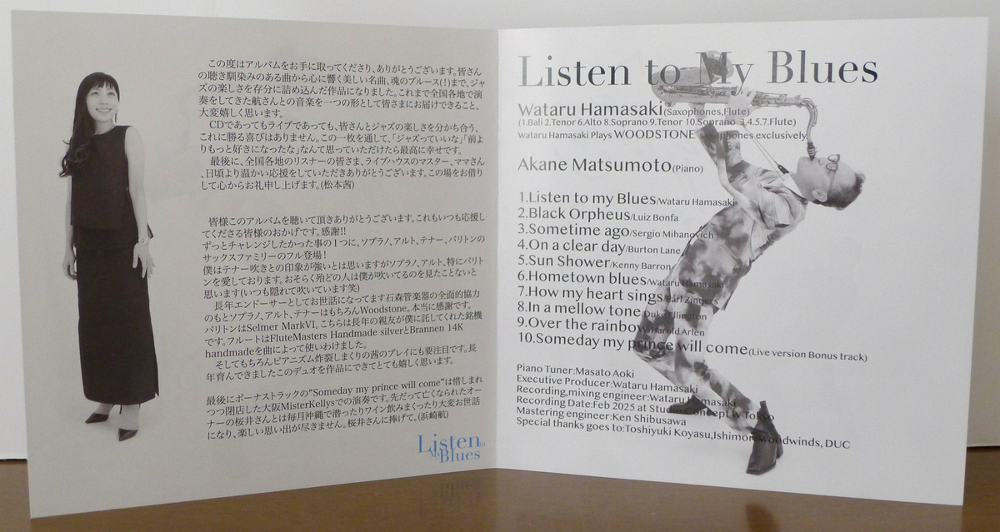
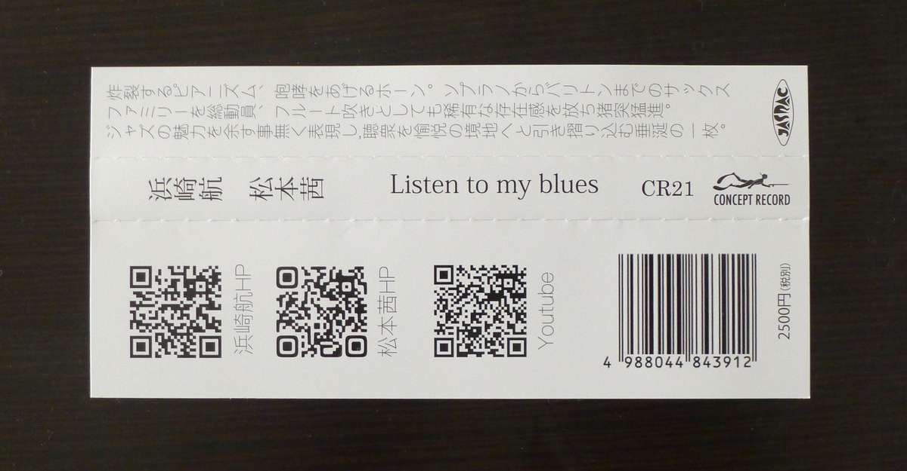

+++
title = "Wataru Hamasaki & Akane Matsumoto: Listen to My Blues"
author = ["Brian McCrory"]
publishDate = 2026-03-29
keywords = ["hideaki-hori-wataru-hamasaki-encounter", "akane-matsumoto-playing-new-york", "hamasaki-matsumoto-bigcatch", "akane-matsumoto-memories-of-you", "akane-matsumoto-night-and-day", "akane-matsumoto-oh-lady-be-good", "akane-matsumoto-little-girl-blue", "akane-matsumoto-nanami-haruta-for", "akane-matsumoto-ayumi-koketsu-trust"]
tags = ["Wataru Hamasaki 浜崎航", "Akane Matsumoto 松本茜"]
categories = ["albums"]
draft = false
[cover]
  image = "wataru-hamasaki-akane-matsumoto-listen-to-my-blues-460.jpeg"
  relative = true
+++

_Listen to My Blues_ is a 2025 jazz release from saxophonist Wataru Hamasaki and pianist Akane Matsumoto. The two musicians are known for performing together many times at live events and recording sessions, including as co-leaders of their Big Catch Quartet, a classy orthodox jazz unit with a soulful, big jazz sound. Additionally, each musician is popular individually as a leader of their own groups, like with Hamasaki’s Encounter quartet,  Matsumoto’s jazz piano trios, and as members of many other bands and combinations.

This latest album is the first time the two have released an album as a duo. Their duo format here neatly follows the intimate, two-musician approach patterned in Matsumoto’s recent recordings. While her early releases focused on the piano trio format (as jazz models, she’s a big fan of the piano styles of Oscar Peterson and Phineas Newborn Jr., with an addictively fascinating play solidly in that mold), her recent albums have explored solo and duo formats. And while Hamasaki’s power and fluency are on mighty display with his co-leader Hideaki Hori in that pair’s long-running Encounter group, his versatility extends to other emotionally rich duos such as with the amazing pianist Mayuko Katakura.

Speaking of versatility and variety, one special feature of this album that Hamasaki had in mind when planning the recording was to accomplish one of his persistent goals, that of using a wide range of instruments throughout the session. Spanning the whole sax family, he blows the baritone sax (track #1, “Listen to My Blues”), tenor sax (#2 “Black Orpheus” and #9 “Over the Rainbow”), alto sax (#6 “Hometown Blues”), and soprano sax (#8 “In a Mellow Tone” and \*10 “Someday My Prince Will Come”), as well as two flutes (#3 “Sometime Ago”, #4 “On a Clear Day”, #5 “Sun Shower”, and #7 “How My Heart Sings”). All tracks but one were recorded in the studio, and the last song is a live bonus track recorded at the famous Osaka club Mister Kelly’s. This closer is included here as a tribute to that favorite jazz club and beloved owner Akira Sakurai, who passed away around the time that the album was being produced, and to whom this album is dedicated.

_Listen to My Blues_ contains ten songs, eight great jazz standards and covers with two originals from Hamasaki, with a running time of about fifty minutes. The sax player’s two original compositions, #1 “Listen to My Blues” and #6 “Hometown Blues” are down-to-earth mid-tempo grooves, as bluesy as the titles indicate. Yet, much of the album switches in high gear, perhaps unusual for a duo recording, and a majority of the songs are taken at uptempo speeds: “Black Orpheus”, #4 “On a Clear Day”, #8 “In a Mellow Tone”, and others are all off to the races. The duo gets into a blue, deeply affecting mood on Kenny Barron’s beautiful song “Sunshower” (#5), and the romantic ballad “Over the Rainbow” (#9) becomes a lovely showcase for Matsumoto’s finely crafted piano intro and Hamasaki’s emotive tenor voice.



## Liner Notes {#liner-notes}

_(Translated from Akane Matsumoto’s and Wataru Hamasaki’s original Japanese liner notes.)_

Thank you very much to everyone who got a hold of this album. From songs that are familiar to all listeners, to heart-stirringly beautiful tunes and soul blues (!), this work is fully packed with the enjoyment of jazz. It brings me so much pleasure to be able to deliver this music to you, unified into singular its form with Wataru-san as we traveled all over the country.

There’s no greater joy than sharing the happiness of jazz with you all, whether through CDs or at live performances. It would make me so happy if this album could result in thoughts like “Wow, jazz is great” and “I like jazz even more than before.”

I would like to thank the listeners, bar masters, and mama-sans at the live venues throughout the country for all your constant and kind support, and I’ll take this opportunity to thank you from the bottom of my heart.

_Akane Matsumoto_

Thank you to everyone who listens to this album. This is also thanks to all those who continue to support us. Gratitude!!

One challenge that I’ve always wanted to try is to bring out the full saxophone family of soprano, alto, tenor, and baritone! There may be a strong impression of me as a tenor player, but I love soprano, alto, and especially baritone sax. Probably most people have not seen me playing those (I’m always hiding when I do so, ha ha).

For many years, I’ve been endorsing Woodstone soprano, alto, and tenor saxophones with the full support of Ishimura Wind Instruments. I am truly grateful.

The baritone sax is a Selmer Mark VI. It’s an excellent instrument that was entrusted to me by an old friend. The flutes include a Flute Masters handmade silver flute and a Brannen 14K handmade flute, both which I use depending on the song.

Of course, paying attention to the relentlessly explosive pianism of Akane’s playing is absolutely essential. I’m so happy that we are able to release an album from the duo that we’ve been cultivating for a long time.

Finally, the bonus track “Someday My Prince Will Come” is a performance from Osaka’s Mister Kelly’s, which regrettably has closed down. I am also greatly indebted to the recently deceased Sakurai-san of Mister Kelly’s, who supported us incredibly, and my fond memories of him and the diving and wine-drinking every month in Okinawa are endless. Dedicated to Sakurai-san.

_Wataru Hamasaki_

## Obi Notes {#obi-notes}

An explosive pianist, a roaring horn. The mad rush of movement and rare presence of the full use of the saxophone family, from baritone to soprano, and even flute playing. An appetizing recording that fully expresses the allure of jazz and pulls listeners into a state of joy.



## Listen to My Blues by Wataru Hamasaki &amp; Akane Matsumoto {#listen-to-my-blues-by-wataru-hamasaki-and-akane-matsumoto}

-   [Wataru Hamasaki](http://www.watarujazz.com) - saxophone
-   [Akane Matsumoto](http://akanejazz.com) - piano

Released in 2025 on Concept Record as CR-21.

_Japanese names: 浜崎航 Hamasaki Wataru 松本茜 Matsumoto Akane_

## Audio and Video {#audio-and-video}

-   [“Listen to My Blues” (duo live, version 1):](https://youtu.be/AJORByi1s-4)



-   [“Black Orpheus” (duo live):](https://youtu.be/QEwTgiJUiHU)



-   [“Listen to My Blues” (duo live, version 2):](https://youtu.be/nFlZcGsD2kE)



-   [“In a Mellow Tone” (duo live):](https://youtu.be/sI3Q1EVew4E)



-   [“What a Wonderful World” (duo live, aquarium version):](https://youtu.be/GYUdJS-GFWc)



-   [“Like Sonny” (duo live):](https://youtu.be/Tt8U1x0SZR4)



-   Excerpt from track #1: “Listen to my Blues” [mix #15](https://www.jazzofjapan.com/archive/audio/#mix-15)


