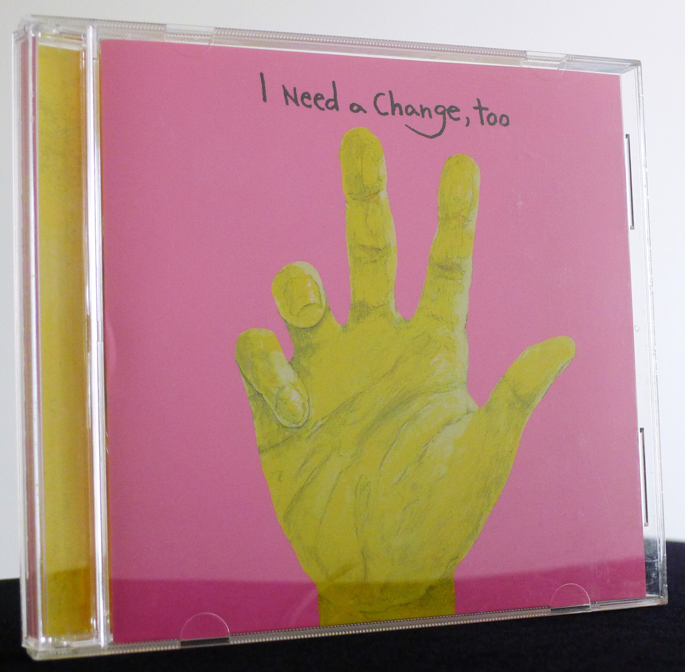
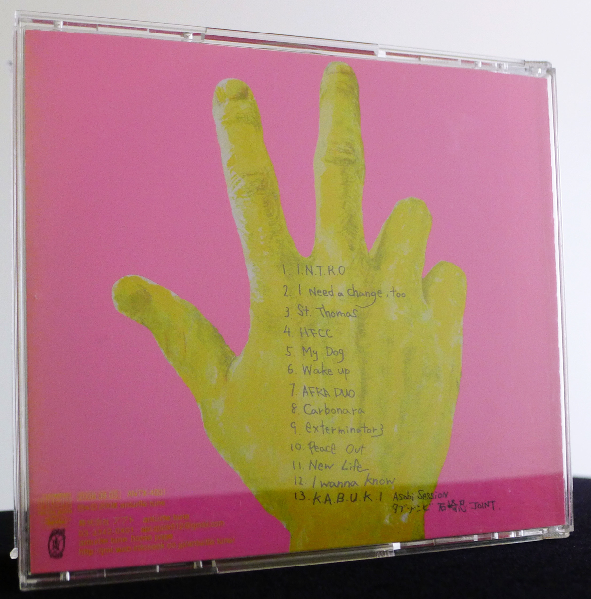
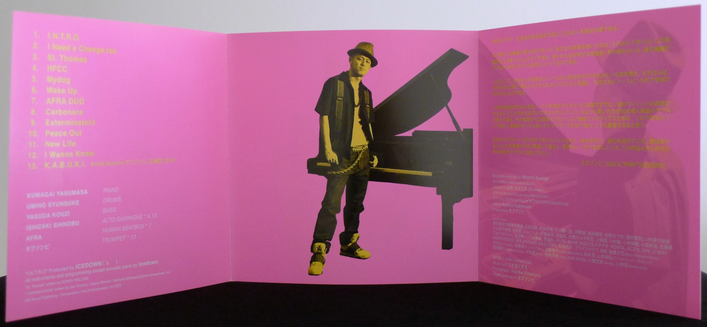

+++
title = "Yasumasa Kumagai: I Need a Change, Too"
author = ["Brian McCrory"]
publishDate = 2018-08-31
keywords = ["yasumasa-kumagai-pray", "yasumasa-kumagai-j-straight-ahead", "yasumasa-kumagai-last-resort"]
lastmod = 2024-03-23
tags = ["Yasumasa Kumagai", "熊谷ヤスマサ", "Koji Yasuda", "安田幸司", "Shunsuke Umino", "海野俊輔", "Afra", "あふら", "Shinobu Ishizaki", "石崎忍", "Tabu Zombie", "タブゾンビ"]
categories = ["albums"]
draft = false
[cover]
  image = "yasumasakumagai-ineed-460.jpeg"
  relative = true
+++

Yasumasa Kumagai’s debut album from 2008, _I Need a Change, Too_, establishes his J Jazz hip hop concept with force: From the shocking pink cover art and the unexpected electronic soulful beats of the brief opening track “I.N.T.R.O.”, the album takes thrilling twists and turns through jazz laced with groove, centered on a powerfully soulful and vibrant modern jazz piano trio.

Fun and catchy but with a serious musical depth, the music covers both cool and bittersweet moods, at times evoking influences from Robert Glasper’s style of gospel-inspired hip-hop jazz. Kumagai’s songwriting skill and precision playing make for a high-quality J Jazz album, full of soul and passion rooted in authentic jazz with ultra-modern sharpness.

Kumagai’s original songs fill the album, along with a cover of the R&amp;B song “I Wanna Know” and a reworked version of Sonny Rollins’s “St. Thomas”, built on an extended tease vamp breaking into high-intensity jazz changes. Most of the songs feature the piano trio, with guest players including alto sax on two tracks, trumpet on one, and a duo track featuring piano with a talented beatbox vocalist as well.



## Liner Notes {#liner-notes}

_(A translation of Tabu Zombie’s original Japanese liner notes.)_

Yasumasa Kumagai. I first heard his name about one year ago.

It was a name that I had often heard spoken around. After about a year passed, I heard him for the first time, playing live at a jazz club that I happened to drop by. I suddenly understood at that time what people had been talking about. His sensitive style and tuneful melodies flowed naturally to my ears.

After a while, I heard that a friend of mine was going to release Kumagai’s CD on his own label, so I begged him to let me be involved in some way. This was how I came to fill the role of producer for this project.

When creating this work and reaching the stage where I listened to the demo, his vision was complete, and he knew clearly the best direction to go at any point. What surprised me most was his good taste in the songs that he wrote. There’s a melodious delicacy that may be hard to imagine from appearances. In this day and age, players who are blessed with a balance of good playing ability and musical sense are extremely valuable.

The type of jazz that evolved in Japan’s mixture culture has again been subdivided, segmented, and continues to change. Kumagai skillfully absorbs and accumulates various genres of music and expresses them in a wonderful way. With this recording as an impetus, definitely keep an eye on Yasumasa Kumagai.

Tabu Zombie (SOIL &amp; “PIMP” SESSIONS)



## I Need a Change, Too by Yasumasa Kumagai {#i-need-a-change-too-by-yasumasa-kumagai}

-   [Yasumasa Kumagai](/tags/yasumasa-kumagai) - piano
-   [Koji Yasuda](/tags/koji-yasuda) - bass
-   [Shunsuke Umino](/tags/shunsuke-umino) - drums
-   [Afra](/tags/afra) - human beatbox (#7)
-   [Shinobu Ishizaki](/tags/shinobu-ishizaki) - alto sax (#9, 13)
-   [Tabu Zombie](/tags/tabu-zombie) - trumpet (#13)

Released in 2008 on Anturtle Tune as ANTX-4001.

_Japanese names: 熊谷ヤスマサ Kumagai Yasumasa 安田幸司 Yasuda Koji 海野俊輔 Umino Shunsuke あふら Afra 石崎忍 Ishizaki Shinobu タブゾンビ Tabu Zombie_

## Audio and Video {#audio-and-video}

-   [Yasumasa Kumagai Trio playing “Bolivia” live in 2017:](https://youtu.be/-kiz2K70Glg)



-   Excerpt from track #2: “iI Need achange,too” [mix #3](https://www.jazzofjapan.com/archive/audio/#mix-3)


