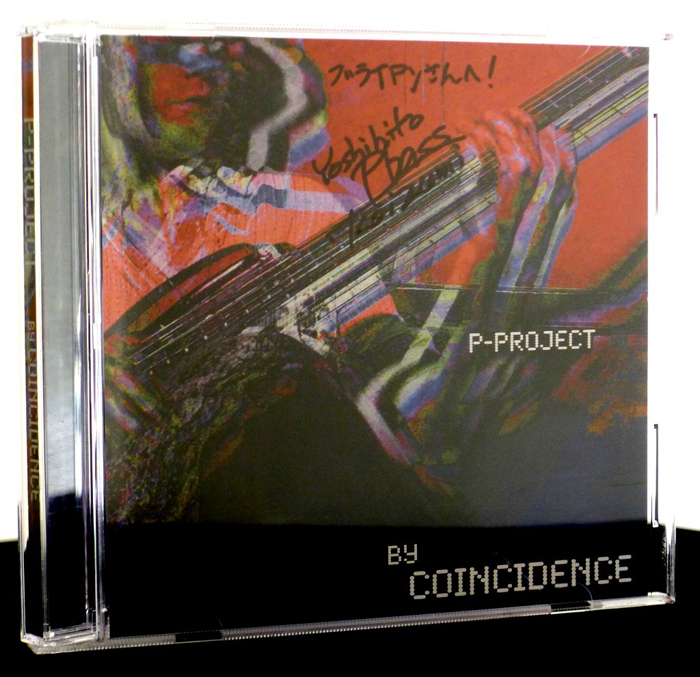
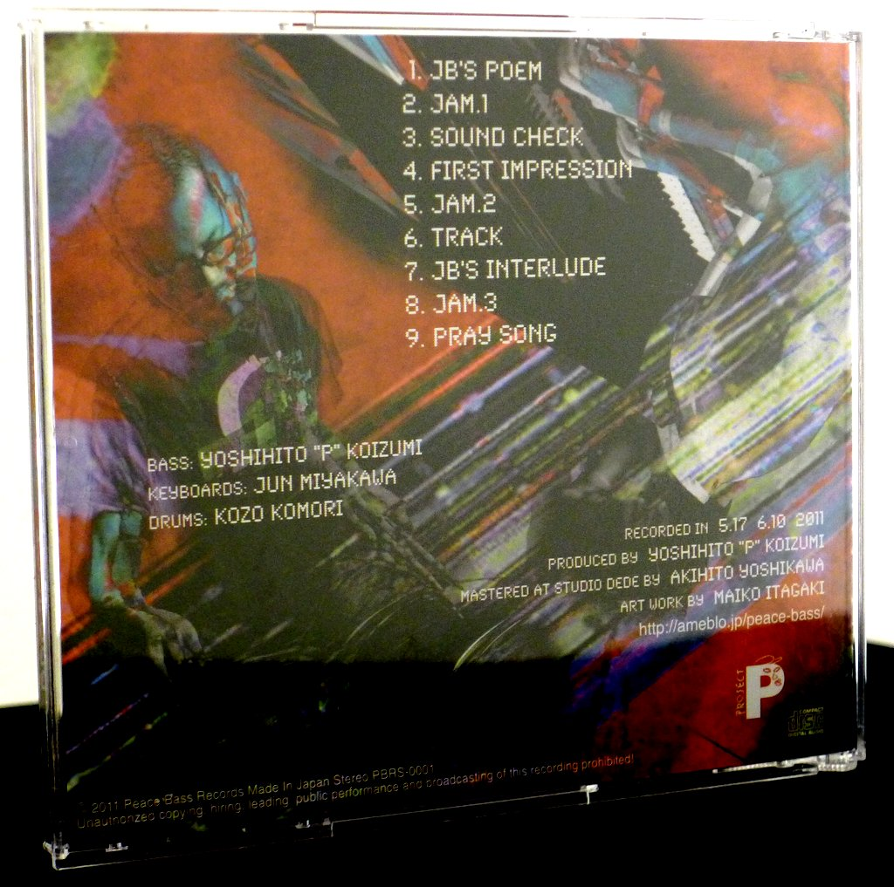

+++
title = "Yoshihito “P” Koizumi P-Project: By Coincidence"
author = ["Brian McCrory"]
publishDate = 2021-05-05
tags = ["Yoshihito “P” Koizumi", "小泉P克人", "Jun Miyakawa", "宮川純", "Kohzo Komori", "小森耕造"]
categories = ["albums"]
draft = false
aliases = ["/archive/yoshihito-p-koizumi-by-coincidence/", "/p/yoshihito-p-koizumi-by-coincidence/"]
[cover]
  image = "yoshihitopkoizumi-bycoin-460.jpeg"
  caption = ""
  relative = true
+++

Jazz, soul, and funk bassist Yoshihito “P” Koizumi is an active member of a number of Japanese jazz groups and events, and the 2011 album _By Coincidence_ marks his debut release as “P-Project” featuring Jun Miyakawa on keyboards and Kohzo Komori on drums. With nine tracks and a running time of 34 minutes, the album is full of funky beats, laid-back grooves, retroesque electronic keyboards, and slick bass lines.

Inspiring an easy-go-lucky party mood, the short songs are all of a piece, several even with unassuming titles such as “Sound Check”, “Track”, “Jam 1”, “Jam 2”, and “Jam 3”. It’s easy to put on the album, kick back, and let the music flow and invigorate the mood without any worries.

While session leader and bassist Koizimi states that the recording was not originally intended to be an official release but perhaps a demo tape or similar, the album was released as a memento of the spontaneity of the date. Many of the tracks are improvisational jams will all but basic structures undetermined, yet the spirit of fun with slick rhythms and exuberant grooves smoothly pours from the tracks.



## By Coincidence by Yoshihito “P” Koizumi P-Project {#by-coincidence-by-yoshihito-p-koizumi-p-project}

-   [Yoshihito “P” Koizumi](/tags/yoshihito-p-koizumi) - bass
-   [Jun Miyakawa](/tags/jun-miyakawa) - keyboards
-   [Kohzo Komori](/tags/kohzo-komori) - drums

Released in 2011 on Peace Bass Records as PBRS-0001.

_Japanese names: 小泉P克人 Koizumi Yoshihito “P” 宮川純 Miyakawa Jun 小森耕造 Komori Kohzo_

## Audio and Video {#audio-and-video}

-   [Video featuring Yoshihito “P” Koizumi from 2008:](https://youtu.be/92l3SdCSd30)



-   Excerpt from track #1: “JB's Poem” [mix #7](https://www.jazzofjapan.com/archive/audio/#mix-7)


