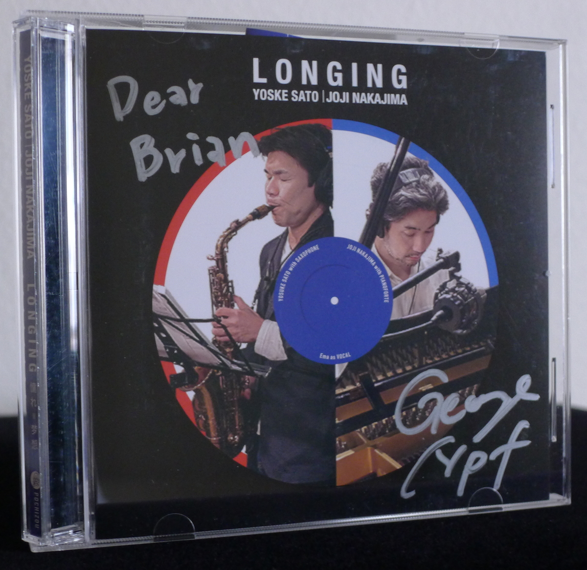
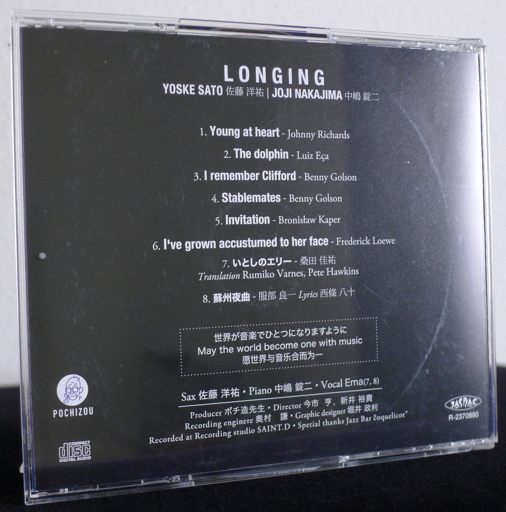
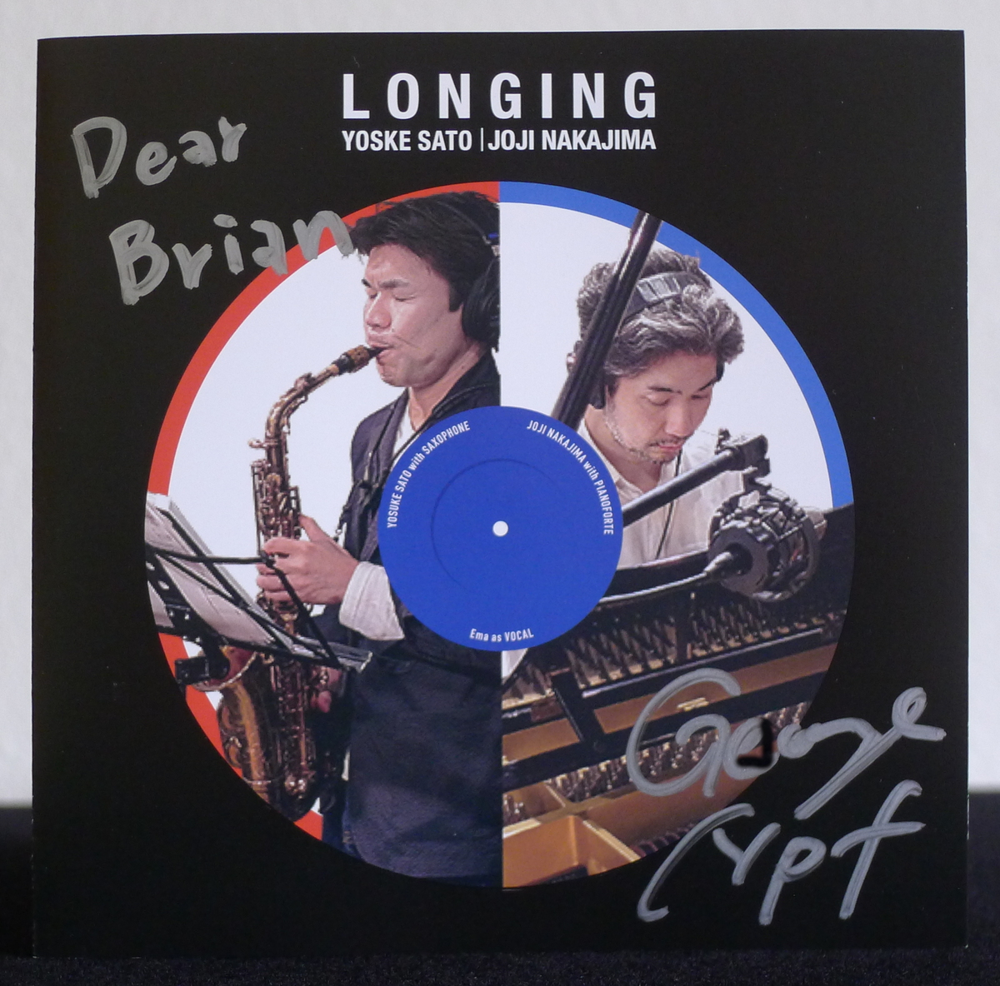
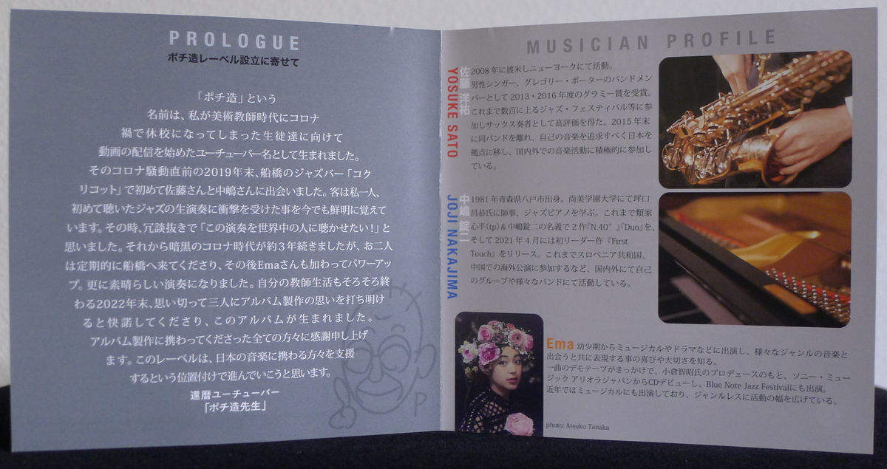
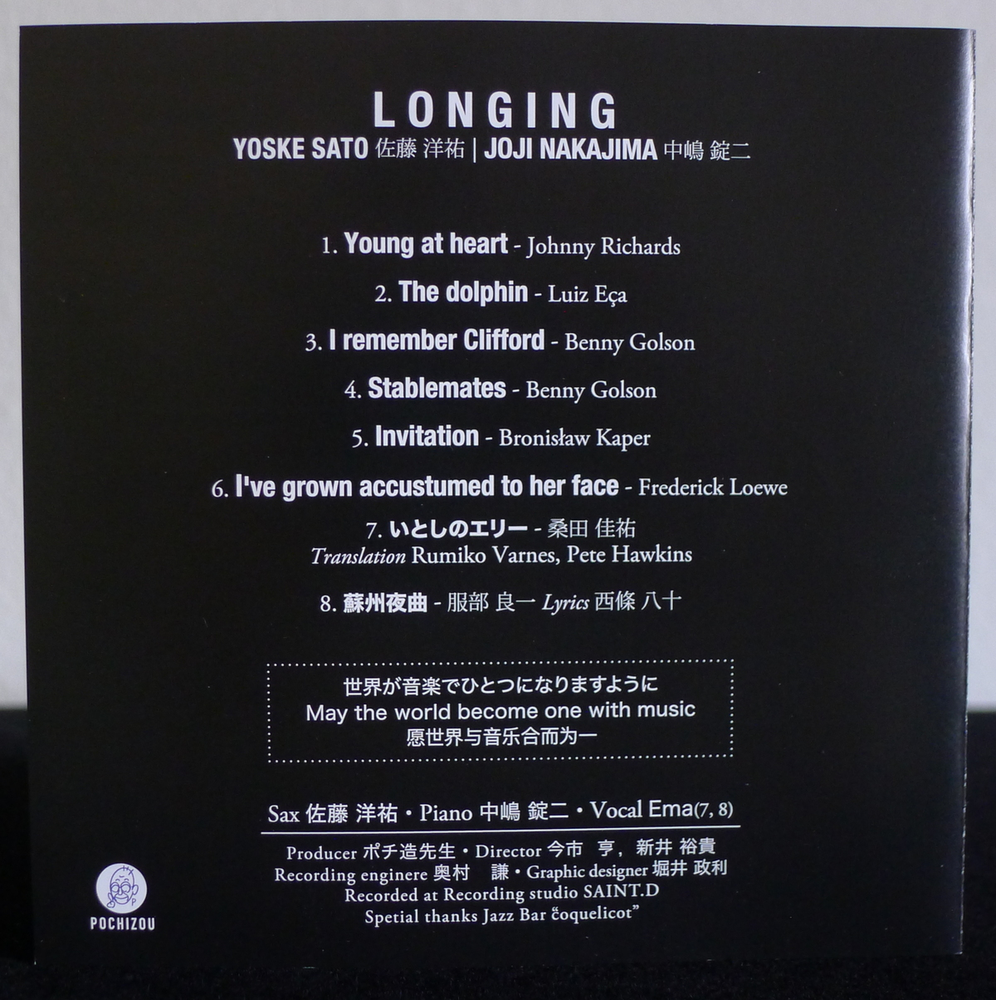

+++
title = "Yosuke Sato & George Nakajima: Longing"
author = ["Brian McCrory"]
publishDate = 2025-05-30
keywords = ["shinpei-ruike-george-nakajima-n40", "george-nakajima-trio-first-touch", "shinpei-ruike-george-nakajima-duo"]
tags = ["Yosuke Sato", "佐藤洋祐", "George Nakajima", "中嶋錠二", "Ema", "エマ"]
categories = ["albums"]
draft = false
aliases = ["/archive/yosuke-sato-george-nakajima-longing/", "/p/yosuke-sato-george-nakajima-longing/"]
[cover]
  image = "yosuke-sato-george-nakajima-longing-460.jpeg"
  caption = ""
  relative = true
+++

_Longing_ is the title of a 2023 jazz duo album from saxophonist Yosuke Sato and pianist George Nakajima. This is an eight-song, forty-five-minute album of familiar jazz standards and two Japanese pop songs. Of the eight songs, the first six are played by the elegant hand-in-glove duo of saxophone and piano. To wrap up the album, the duo becomes a trio as vocalist Ema joins in for the last two songs, singing beautifully in English and Japanese. The album’s title _Longing_ may lean into some unnamed persistent desire portrayed in their playing, the long ago brought to life through their selection of timeless songs.

Among the selections, the Sato and Nakajima duo plays two songs from the Great American Songbook, the sweetly loveable #1 “Young at Heart” and the pretty ballad #6 “I’ve Grown Accustomed to Her Face”. These two songs, along with the tender tribute ballad #3 “I Remember Clifford”, are played at a slow pace, and the two musicians play with a feeling of comfortable relaxation that sinks in easily. Three other popular jazz standards played as a duo are #2 “The Dolphin”, #4 “Stablemates”, and #5 “Invitation”, where Sato and Nakajima moderately turn up the gas and tempos with more advanced changes and adventurous playing.

The final two songs are Japanese pop ballads from different long-ago eras. Track #7 “Itoshi no Ellie (Ellie, My Love)”,  is a classic love ballad released in 1979 by the popular Japanese supergroup Southern All Stars (_[video](https://youtu.be/cFXXdyFy6_Q)_). Here on _Longing_, Ema and Nakajima introduce the song in a nice-and-bluesy rubato style as the singer melodically storytells in English and adds some Japanese in the second half, where Sato brings in a rousing sax solo.

Track #8 “Soshu Yakyoku” (“Suzhou Nocturne”, 素週夜曲, _[video 1](https://youtu.be/w0ht7Wkkc3s)_, _[video 2](https://youtu.be/O8S9u8IfDwM)_) was written by the innovative composer Ryoichi Hattori in 1940 for a movie set in the ancient Chinese city of Suzhou. It has the feel of a sentimental ballad from a different generation, fitting the Shangai Jazz Age mood in this “Paris of the East”, and the song’s softly moving harmonies, pentatonic scale notes, and structure romantically evoke a bygone Asian era. On _Longing_, Ema sings the song entirely in Japanese, and the musicians play with a melancholic feel that is suitably dusky (_yakyoku_ as nocturne, night song) and lovingly nostalgic.



## Liner Notes {#liner-notes}

_(Translated from the original Japanese liner notes.)_

**PROLOGUE**

**About founding the Pochizou label**

The “Pochizou” name was born when I began uploading videos as an art teacher/Youtuber for my students while my school was closed during the Covid pandemic.

I first met Sato and Nakajima in 2019 at the jazz bar Coquelicot in Funabashi, just before the coronavirus turmoil heated up. I was the only customer, but I can still vividly remember the impact of hearing their live jazz performance for the first time. I said at the time, not jokingly, “I wish everyone in the world could hear this!” The dark period of Covid continued for the next three years, during which these musicians would still regularly come out to Funabashi to play. Ema joined them later, increasing their impact which resulted in an even more wonderful performance. At the end of 2022, as my teaching career was winding down, I boldly confided my thoughts about making an album to the three musicians, and they readily agreed. That is how this album was born.

I would like to thank everyone who was involved in the making of this album. I hope that this label can make progress in supporting those involved in Japanese music.

Sexagenarian Youtuber “[Pouchizou Sensei](https://www.youtube.com/@pochizou)”

**MUSICIAN PROFILE**

**YOSUKE SATO**

Yosuke Sato moved to the US in 2008 and started playing in New York. He won Grammy Awards in 2013 and 2016 as a member of singer Gregory Porter’s band. He has received high acclaim as a jazz saxophonist and has participated in hundreds of jazz festivals up through the current day. Sato departed the band in 2015 and moved his base to Japan to pursue his music, actively participating in musical events domestically and abroad.

**GEORGE NAKAJIMA**

George Nakajima was born in 1981 in Hachinohe, Aomori Prefecture. He studied jazz piano under Masayasu Tzuboguchi at Shobi University. He has released two albums as the duo Shinpei Ruike &amp; George Nakajima, _[N.40°](https://www.jazzofjapan.com/archive/shinpei-ruike-george-nakajima-n40)_ and _[Duo](https://www.jazzofjapan.com/archive/shinpei-ruike-george-nakajima-duo)_. His first leader album, _[First Touch](https://www.jazzofjapan.com/archive/george-nakajima-trio-first-touch)_, was released in April 2021. Nakajima has participated in overseas performances in the Republic of Slovenia, China, and elsewhere, and is active in many groups and his combos both inside and outside Japan.

**EMA**

From an early age, Ema has appeared in musicals and dramas, learning the joy and importance of expression while encountering various musical genres. She started with a single-song demo tape and continued under the guidance of producer Tomoaki Ogura to release her debut record with Sony Music Ariola Japan and perform at the Blue Note Jazz Festival. In recent years Ema has starred in musicals and expanded her range into genreless activities.



## Longing by Yosuke Sato &amp; George Nakajima {#longing-by-yosuke-sato-and-george-nakajima}

-   [Yosuke Sato](/tags/yosuke-sato) - sax
-   [George Nakajima](/tags/george-nakajima) - piano
-   [Ema](/tags/ema) - vocals (#7, 8)

Released in 2023 on Pochizou as POCH-2308.

_Japanese names: 佐藤洋祐 Sato Yosuke 中嶋錠二 Nakajima George エマ Ema_

## Audio and Video {#audio-and-video}

-   [Live duo performance of “The Dolphin”, track #2 on this album:](https://youtu.be/KUcareCD3Yc)



-   [Live trio performance of “Peel Me a Grape”:](https://youtu.be/_vNsG9sZAM4)



-   [Live trio performance of “Our Love Is Here to Stay”:](https://youtu.be/p0x97PtEC7o)



-   [Live duo performance of “There Will Never Be Another You”:](https://youtu.be/KLsBb2cRbtA)



-   [Live duo performance of “Body and Soul”:](https://youtu.be/vB3exIDNqeA)



-   Excerpt from track #4: “Stablemates” [mix #13](https://www.jazzofjapan.com/archive/audio/#mix-13)


