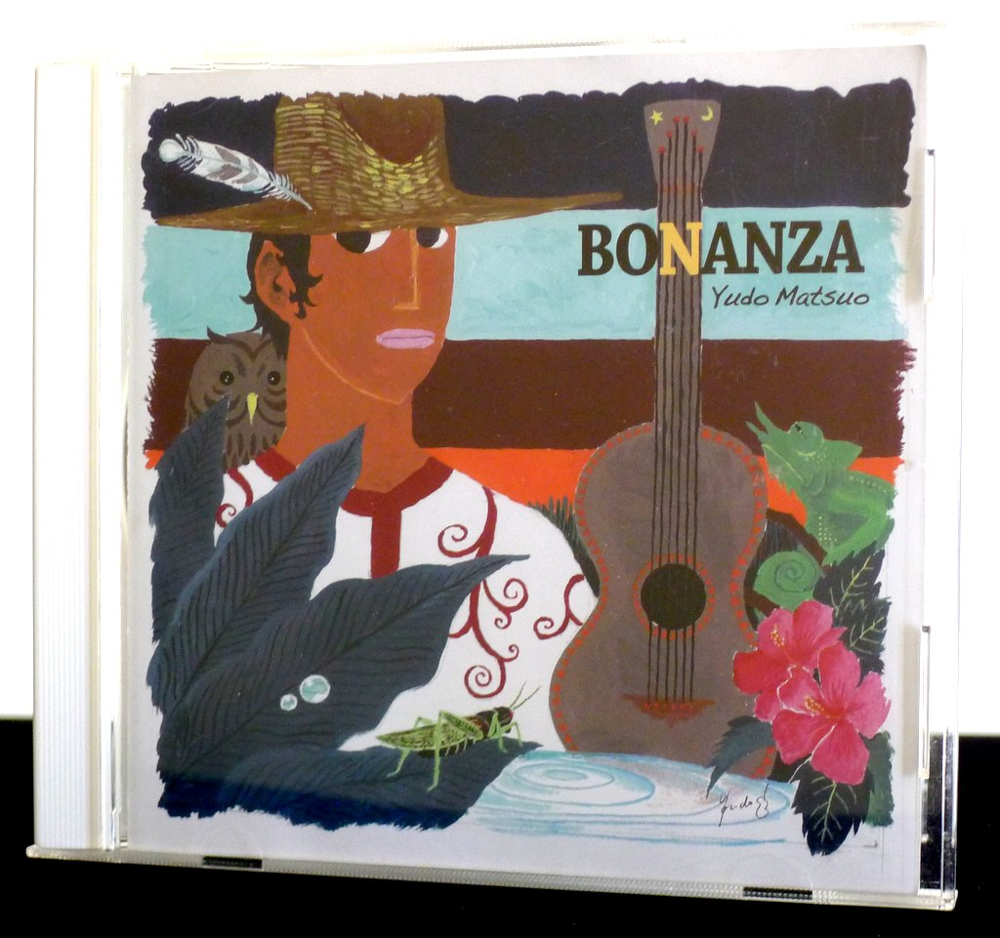
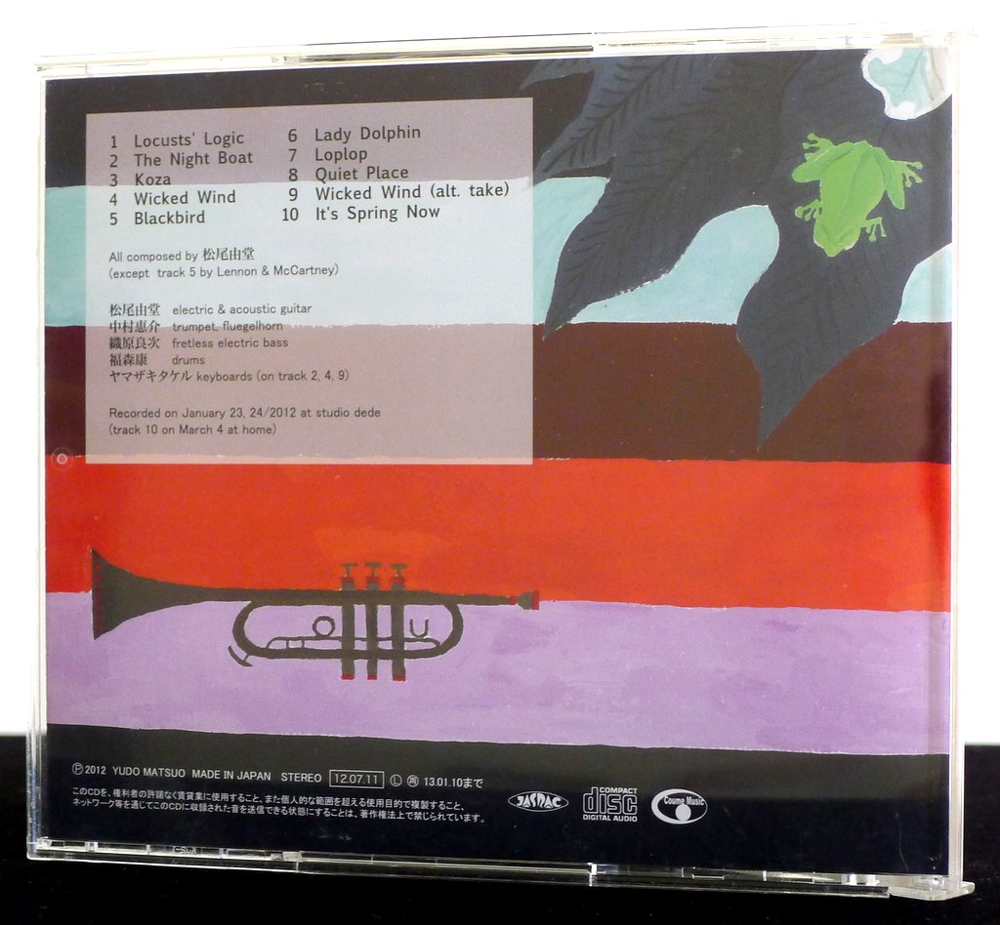
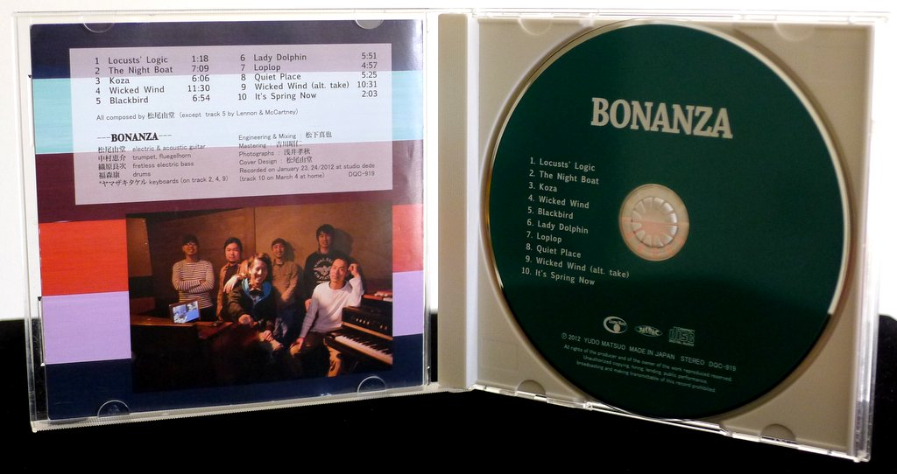
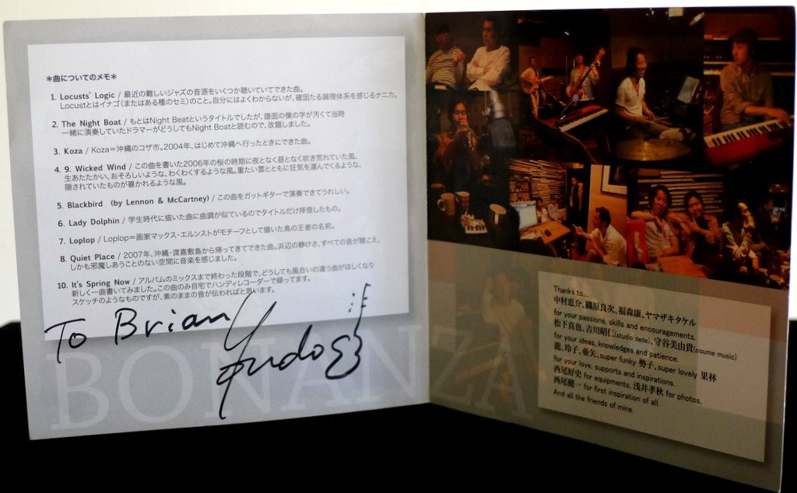
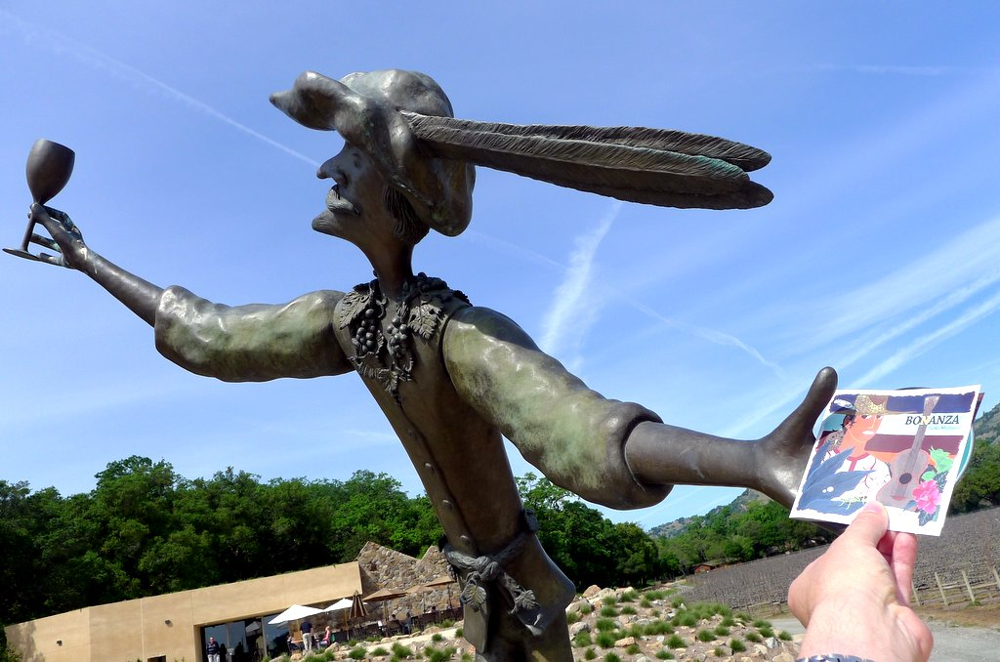

+++
title = "Yudo Matsuo: Bonanza"
author = ["Brian McCrory"]
publishDate = 2020-02-07
tags = ["Yudo Matsuo", "松尾由堂", "Keisuke Nakamura", "中村恵介", "Ryoji Orihara", "織原良次", "Yasushi Fukumori", "福森康", "Takeru Yamazaki", "ヤマザキタケル"]
categories = ["albums"]
draft = false
aliases = ["/archive/yudo-matsuo-bonanza/", "/p/yudo-matsuo-bonanza/"]
[cover]
  image = "yudomatsuo-bonanza-460.jpeg"
  caption = ""
  relative = true
+++

_Bonanza_, from 2012, is the debut release from guitarist Yudo Matsuo, whose kinetic quartet performs original songs with influences from electric jazz fusion to pop songwriters, a palette of sounds reflecting his varied artistic sides.

The core band is made up of guitar, trumpet, fretless electric bass, and drums, with guest keyboard on three tracks adding a warm bluesy sound for extra soul. While much of the music is built around a fusion jazz/rock mood which runs through the album, the dial also moves to include smooth jazz sounds, evocative jazz waltzes, and pop, including a rendition of “Blackbird” by The Beatles. One track, “Loplop”, comes closest to pure bop guitar with a fast swing beat and walking bass, where Matsuo plays quick jazzy lines in the style of guitarists such as Tal Farlow and Pat Martino.

Bonanza’s jazz/fusion side is displayed best on the track “Wicked Wind”, an 11-plus minute jam which boils with energy and echoes the electric fusion periods of Miles Davis and Herbie Hancock to some extent. With developed excitement on extended trumpet and guitar solos played over a rousing bass and drum riff, and including a drum feature near the end, one almost expects to hear a crowd’s roar after the final note is played. In fact, a second alternate take of this song is included near the end of the album, a welcome encore of this satisfying set piece.

All the musician shine with visceral playing and a clean sound, with solos, duos, and group features arranged among the songs. Adding to the variations in mood are Matsuo’s use of acoustic and electric guitar selected to suit the material, as well as trumpeter Keisuke Nakamura alternating between trumpet, flugelhorn, and even adding real-time delay, wah-wah, and distortion effects to his horn at several dramatic moments. As for the indefatigable rhythm section, the impressively twisty lines from bassist Ryoji Orihara move with glissando slides, deep pops, and high ringing harmonic tones, and add a lot to the music along with the tight patterns and quick reactions from drummer Yasushi Fukumori, who uses the complete set to great effect with brilliant dynamics and incredible playing.

## Bonanza by Yudo Matsuo {#bonanza-by-yudo-matsuo}

-   [Yudo Matsuo](/tags/yudo-matsuo) - electric &amp; acoustic guitar
-   [Keisuke Nakamura](/tags/keisuke-nakamura) - trumpet, flugelhorn
-   [Ryoji Orihara](/tags/ryoji-orihara) - fretless electric bass
-   [Yasushi Fukumori](/tags/yasushi-fukumori) - drums
-   [Takeru Yamazaki](/tags/takeru-yamazaki) - keyboards (#2, 4, 9)

Released in 2012 on Coume Music as DQC-919.

_Japanese names: 松尾由堂 Matsuo Yudo 中村恵介 Nakamura Keisuke 織原良次 Orihara Ryoji 福森康 Fukumori Yasushi ヤマザキタケル Yamazaki Takeru_

## Audio and Video {#audio-and-video}

-   [Bonanza performing “Loplop” live, the seventh track on this album:](https://youtu.be/Q20K_CbMosU)



-   Excerpt from track #4: “Wicked Wind” [mix #5](https://www.jazzofjapan.com/archive/audio/#mix-5)


