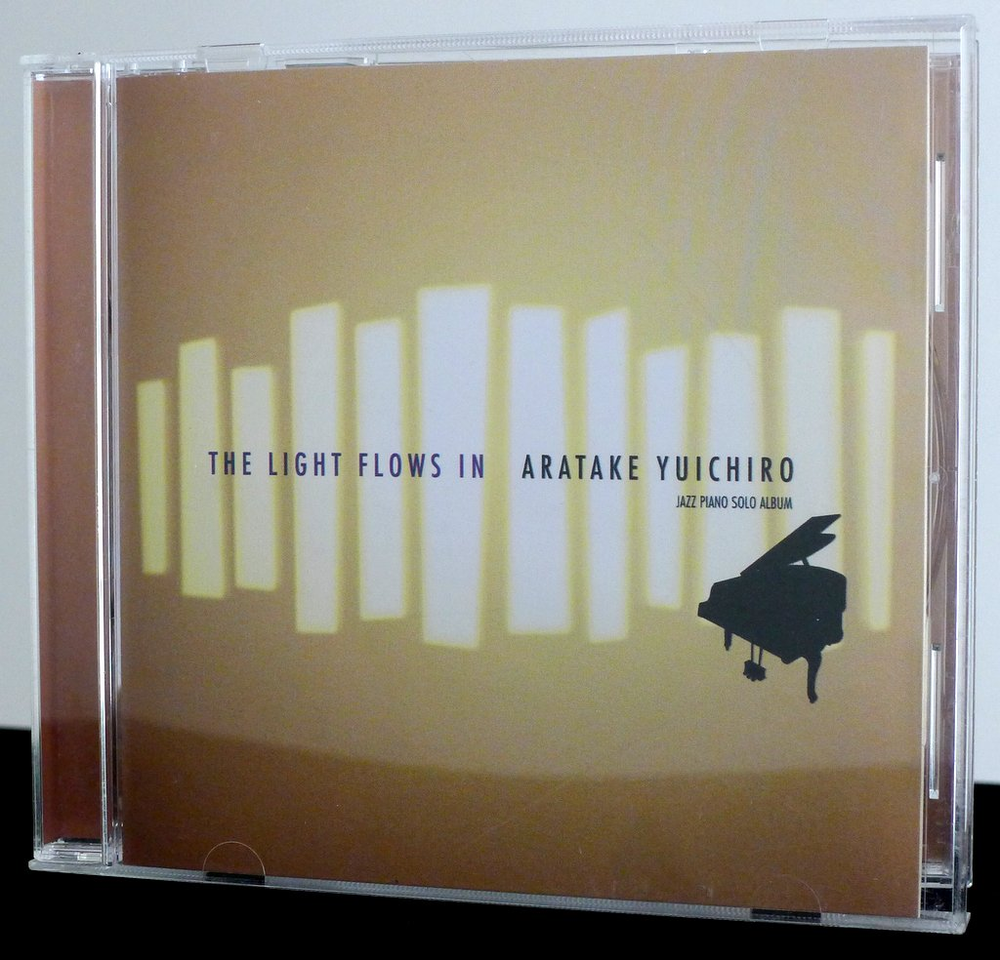
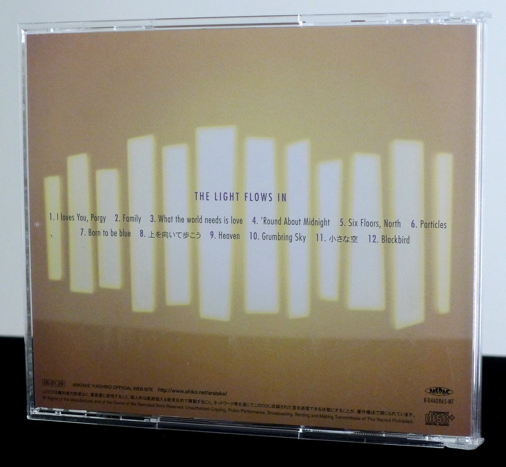
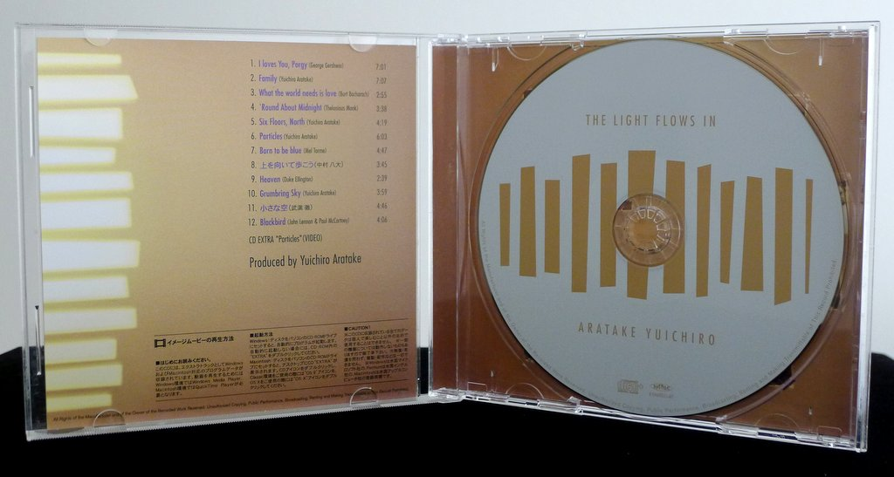
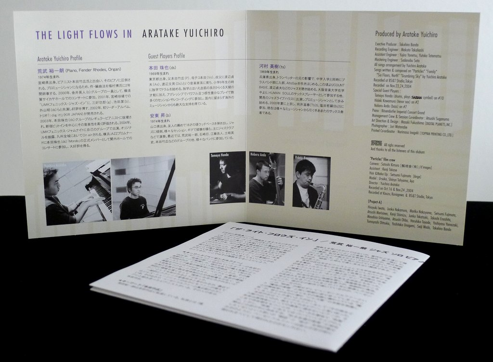

+++
title = "Yuichiro Aratake: The Light Flows In"
author = ["Brian McCrory"]
publishDate = 2019-05-09
tags = ["Yuichiro Aratake", "荒武裕一朗", "Tamaya Honda", "本田珠也", "Hideki Kawamura", "河村英樹", "Noboru Ando", "安東昇"]
categories = ["albums"]
draft = false
aliases = ["/archive/yuichiro-aratake-light-flows-in/", "/p/yuichiro-aratake-light-flows-in/"]
[cover]
  image = "yuichiroaratake-light-460.jpeg"
  caption = ""
  relative = true
+++

Yuichiro Aratake’s _The Light Flows In_ is a solo piano collection which sets a calm, relaxing mood, offering peace through original songs and charming jazz and pop standards. With patience and sincerity, Aratake performs the pieces as slow ballads, reflecting the gratitude for loyalty, friendship, and support that inspired the performances.

This album features a special Bösendorfer Imperial Concert Grand piano, the deep and full tones echoing beautifully as the pianist moves freely through his selection of originals and familiar covers (“I Loves You, Porgy”, “Round About Midnight”, “What The World Needs Now”, “Blackbird”).

In addition to solo piano, 3 of the 12 tracks feature duos: a piano and sax outing on the warm “Family”, a bluesy “Born To Be Blue” for piano and bass, and a vibrant outpouring on “Grumbling Sky”, a piano and drums duo, the one spot on the album which departs from the otherwise tranquil mood. Aside from this charged track, the otherwise quiet solo piano ballads consistently evoke peace and love, ringing through this album with a comforting sense of togetherness.

## The Light Flows In by Yuichiro Aratake {#the-light-flows-in-by-yuichiro-aratake}

-   [Yuichiro Aratake](/tags/yuichiro-aratake) - piano
-   [Tamaya Honda](/tags/tamaya-honda) - drums (tr. #10)
-   [Hideki Kawamura](/tags/hideki-kawamura) - tenor sax (tr. #2)
-   [Noboru Ando](/tags/noboru-ando) - bass (tr. #7)

Released in 2005 on S2S as SSDF-5006.

_Japanese names: 荒武裕一朗 Aratake Yuichiro 本田珠也 Honda Tamaya 河村英樹 Kawamura Hideki 安東昇 Ando Noboru_

## Audio and Video {#audio-and-video}

-   [Yuichiro Aratake trio playing live in 2014:](https://youtu.be/ebEHjCZrLi8)



-   Excerpt from track #1: “I loves You,Porgy” [mix #4](https://www.jazzofjapan.com/archive/audio/#mix-4)


