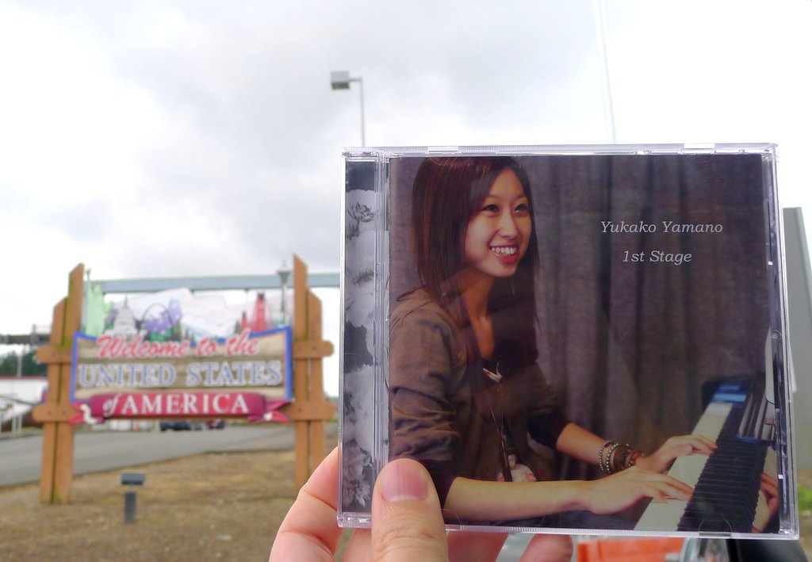

+++
title = "Yukako Yamano: 1st Stage"
author = ["Brian McCrory"]
publishDate = 2018-08-08
tags = ["Yukako Yamano", "山野友佳子", "Koichi Osamu", "納浩一", "Manabu Fujii", "藤井学"]
categories = ["albums"]
draft = false
aliases = ["/archive/yukako-yamano-1st-stage/", "/p/yukako-yamano-1st-stage/"]
[cover]
  image = "yukakoyamano-first-460.jpeg"
  caption = ""
  relative = true
+++

Popular pianist Yukako Yamano’s _1st Stage_ is a rich and airy musical soufflé. Her catchy debut album from 2013 mixes together swinging jazz, modern fusion, cute pop, and straightforward sincerity. On _1st Stage_, the world-traveling pianist introduces eleven of her feel-good melodies and propulsive rhythms as she balances unpretentious cheer with dramatic tension on the lively tracks.

The listener may notice subtle Japanese pop and classical influences in the playing. With quick energy and clever movements, the music is fun, bold, and sincere. The songs vary from grooving straight-beat swing (“Over Parents”, “On A Sunny Moon”), rock-style solo piano (“Galopping Ponies”), romantic, sad ballads (“Another Step”, “Kanashimi No Mukougawa”), serious adventures (“Double A”, “City Walker”), anthemic ballad-rock (“Kanashimi No Mukougawa”), and quirky, candy-sweet fusion (“Wild Sweets”). On the whole, the album strives to involve the listener directly without overcomplicating the compositions, all while ensuring the musicians are having fun creating music together and keeping the audience hooked.

_1st Stage_ features Yukako Yamano on piano along with regular trio members multi-genre drummer Manabu Fujii and well-known bassist Koichi Osamu, both professional and accomplished musicians in their own right. All of the songs on this album were written by Yamano Yukako.

## 1st Stage by Yukako Yamano {#1st-stage-by-yukako-yamano}

-   [Yukako Yamano](/tags/yukako-yamano) - piano
-   [Koichi Osamu](/tags/koichi-osamu) - bass
-   [Manabu Fujii](/tags/manabu-fujii) - drums

Released in 2013 on Yukako Yamano as YKRN-0001.

_Japanese names: 山野友佳子 Yamano Yukako 納浩一 Osamu Koichi 藤井学 Fujii Manabu_

## Audio and Video {#audio-and-video}

-   [A live performance from 2013 of “On A Sunny Moon”, track #6 on this album:](https://youtu.be/fA0kHQ8h_EM)



-   Excerpt from track #1: “Over Parents” [mix #3](https://www.jazzofjapan.com/archive/audio/#mix-3)


