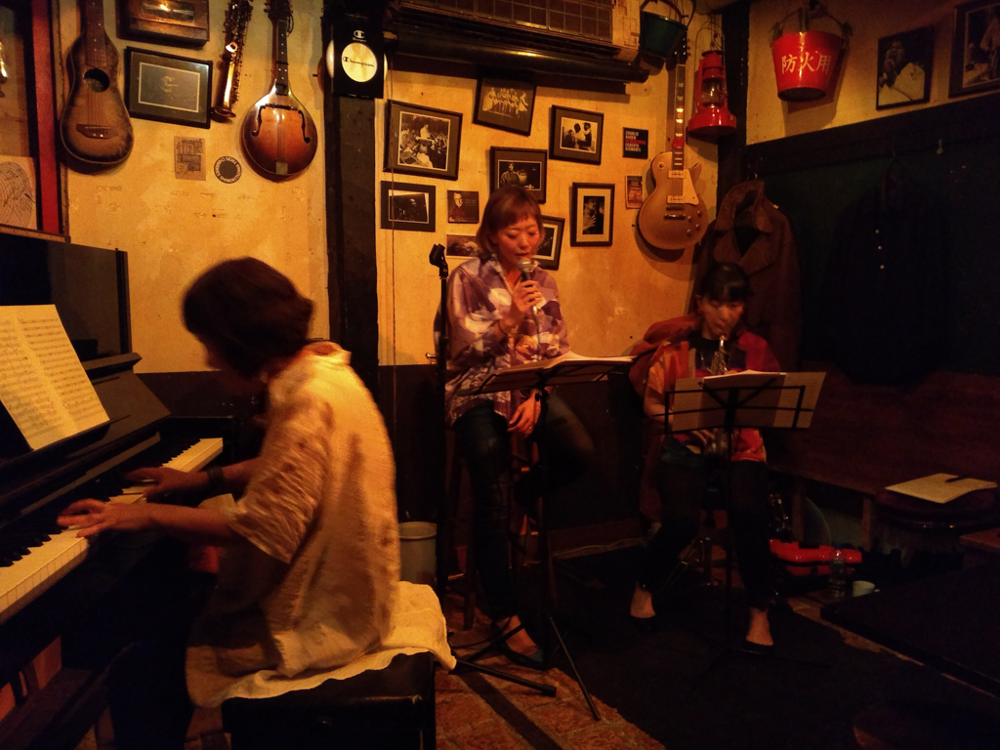

+++
title = "Apollo"
author = ["Brian McCrory"]
publishDate = 2023-05-29
tags = ["clubs", "premium"]
categories = ["clubs"]
draft = false
[cover]
  image = "IMG_20181020_203433884-1024.jpeg"
  relative = true
+++

A straight-to-the-point jazz spot, Apollo is unvarnished in a good way, a simple and deeply satisfying jazz bar in Tokyo. This place offers cool and creative jazz groups and foreign acts from overseas on occasion. What you’ll get here is cozy creativity and originality with no pretensions. This fantastic spot also hosts instrumental jazz jam sessions on select Sunday afternoons.

More down to earth than upper-crust, some customers may feel uncomfortable in this dark, soulful spot, but the underground vibe here adds to the charm of the authentic Apollo experience. Let the otherworldly music take you on a journey aboard Apollo, where a bit more avante-garde music is appreciated and flows freely through this atmospheric space.


