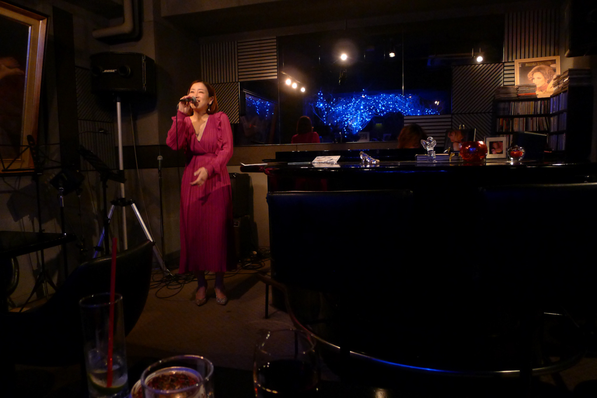

+++
title = "Barbra"
author = ["Brian McCrory"]
publishDate = 2023-05-25
tags = ["clubs", "premium"]
categories = ["clubs"]
draft = false
[cover]
  image = "L1030324-1024.jpeg"
  relative = true
+++

A lovely place in one of the more expensive nightlife centers of the metropolis, Barbra provides a fun balance of class and comfort, with beautiful, talented vocalists and instrumentalists and snazzily-dressed bartenders all contributing to the upscale mood. Classy cocktails are featured and light seasonal snacks are often available.

Grab a seat at the bar or amble right up to the seats at the piano to get close up to the performers and the music, where you can’t miss the photo of the bar’s namesake celebrity near the piano or the huge, eye-catching artwork on the adjacent wall.

If you’re up for it, request a song from the bar master Kazuma-san (“Can’t Help Falling In Love” is a popular request) who summons up memories of his past as a young idol in the world of Tokyo pop. On special event nights, customers may also be able to join in on stage with the supportive musicians and staff.


