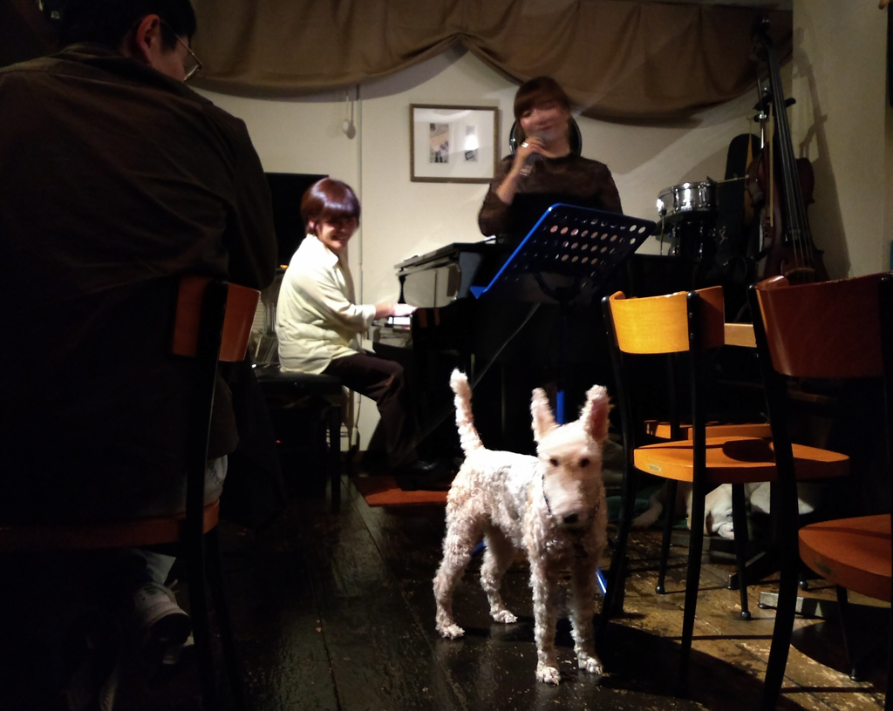

+++
title = "Bully's"
author = ["Brian McCrory"]
publishDate = 2023-06-01
tags = ["clubs", "premium"]
categories = ["clubs"]
draft = false
[cover]
  image = "IMG_20181116_230632667x-1024.jpeg"
  relative = true
+++

Bully’s is a jazz joint where good music and honest cooking brighten up the evening. Cheekily named for the gruff proprietor with a soft heart, the “old Edo Japanese” workingman’s hangout. As jazz music fills the main room, the owner mostly stays behind the counter mixing drinks and cooking, while his daughter (affectionately known as Bully Two) can sometimes be found working the bar here. She also plays a mean jazz saxophone and on special occasions may join in on a few bebop tunes.

The relaxed atmosphere is also lightened by one or two sleepy dogs who mostly doze beneath the piano but may peek out and amble quietly through the room.

Bully’s is a great, simple place with an easy atmosphere and good music. A variety of satisfying menu items is available, including a tasty cheese plate and home-cooked chicken chashu.




