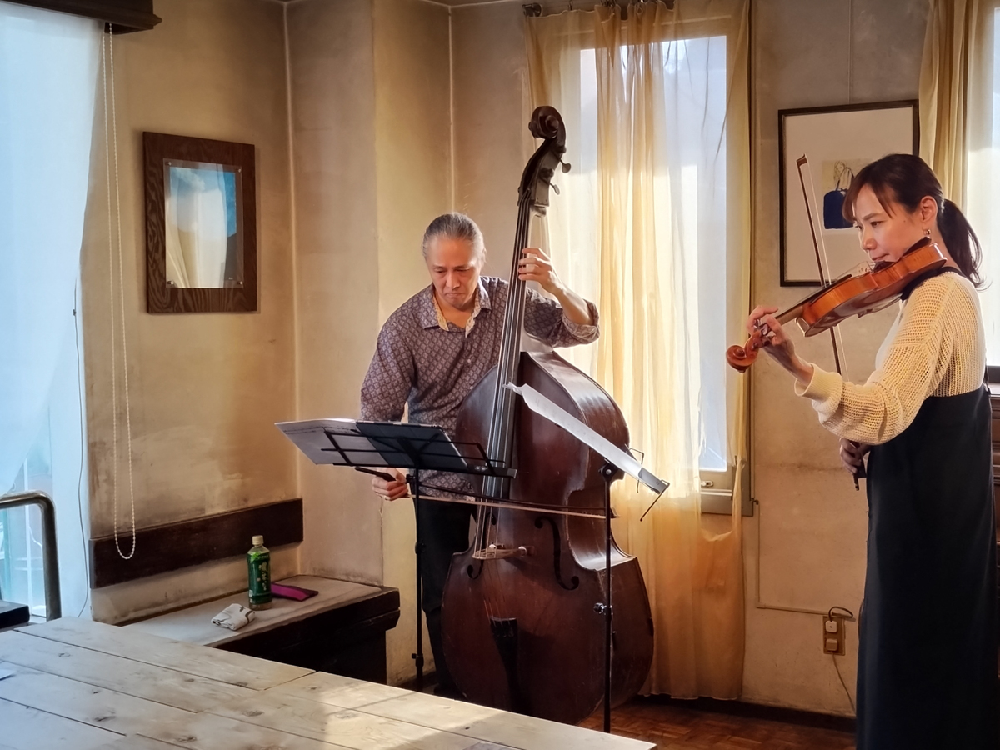

+++
title = "Cafe Beulmans"
author = ["Brian McCrory"]
publishDate = 2023-05-30
tags = ["clubs", "premium"]
categories = ["clubs"]
draft = false
[cover]
  image = "IMG_20181117_150312893_HDR-1024.jpeg"
  relative = true
+++

Cafe Beulmans is a charming and cheery jazz house that seems like a mix of a chamber music studio and a museum room with the comfort of a grandmother’s living room. Seats in the recital space and small bar area all have excellent views of the musician who perform in front of curtained windows. For especially full events, there is also a second viewing room, separated from the front room by a wall containing a large arch through which the rear audience can watch and hear the performance.

This jazz spot hosts both daytime and evening events on specific days. While this destination may seem out of the way for some, Cafe Beulmans is quite easy to get to from Shinjuku station using the Odakyu Line and provides a nice daytime “coffee and jazz” cafe alternative for those seeking a change from the usual late-night jazz bar experience.


