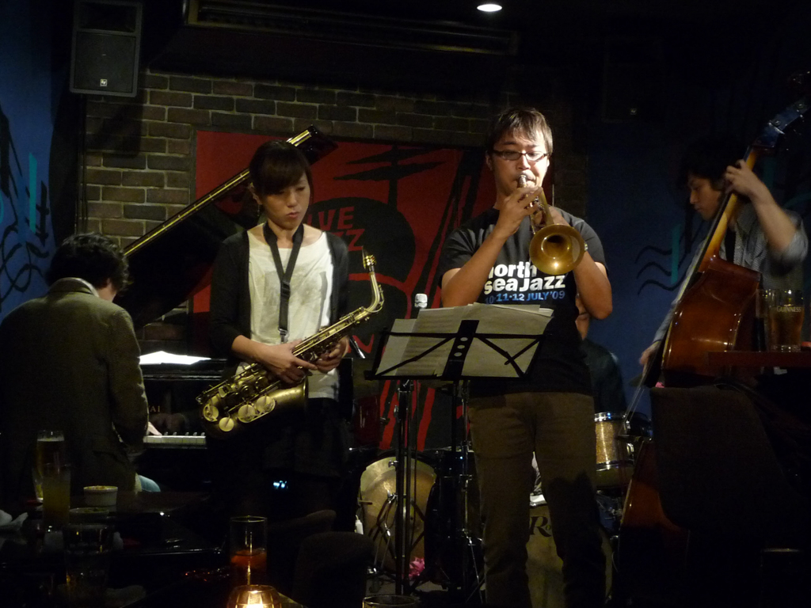

+++
title = "Donfan"
author = ["Brian McCrory"]
publishDate = 2023-06-26
tags = ["clubs", "premium"]
categories = ["clubs"]
draft = false
[cover]
  image = "P1020108-1024.jpeg"
  relative = true
+++

Donfan (Don Juan) is a relaxing and casual jazz bar with a family feel and neighborhood friendliness. Small dishes are served and the usual assortment of beer and liquor is available. Shows usually start a little later than normal (8:30 pm) and may last until late at night.

The musicians are top-notch and depending on the performers you may be amazed at the high quality and professionalism of the musicianship. The main owner and bartender, Shinobu-san, is ever friendly and may sit with customers between sets and chat happily about anything. A feeling of fun and anything-can-happen spontaneity abounds here. Holidays are festive, and Halloween is also a fun time to visit—simple costumes, hats, and masks, may be provided to the band and audience members to enliven the atmosphere.




