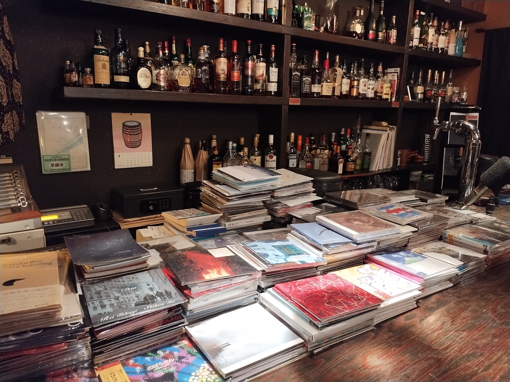
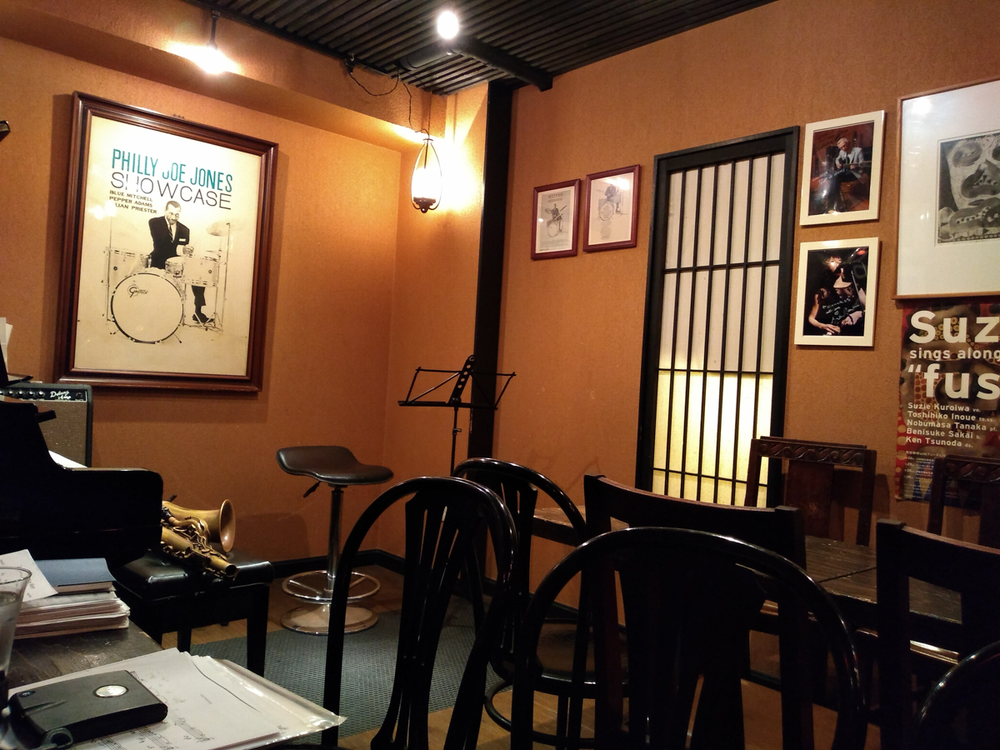

+++
title = "Kanmachi 63"
author = ["Brian McCrory"]
publishDate = 2024-10-08
tags = ["clubs", "premium"]
categories = ["clubs"]
draft = false
[cover]
  image = "IMG_20190517_213722719-1200.jpeg"
  relative = true
+++

Clean, simple, and comfortable, Kanmachi 63 (上町63) in Kannai, Yokohama is an authentic jazz lover’s hangout. It’s especially a great choice for those times when there’s a desire to concentrate on live and unbounded jazz music with minimal distractions.

The tiny bar supplies just what a listener needs: a small stage area, several simple seats and tables, and not much else. A curated collection of modern Japanese jazz music fills the air during breaks, and high-quality recordings and authorized bootlegs of live performances recorded here are also in rotation.

Some local jazz CDs are stacked on the bar, available for sale, and also give a good overview of some of the local Japanese jazz musicians who perform at Kanmachi 63 and other clubs.



Regardless of the style of jazz being played, the up-close and personal feel of the musicians creating otherworldly music right in front of listeners makes a strong impression. This state of being starts when descending into the space, setting the initial conditions for symbolic musical escape. Like many other jazz clubs in Japan, being located in the basement of a large building helps to create a separation from the ordinary exterior world and this underground haven.

Kanmachi 63 is one of those distinct special places where the outside world can be temporarily paused and forgotten while live music is created, improvised, shared, and enjoyed within. Also along those lines, little to no exterior sound leaks into the room from outside, which helps to make Kanmachi 63 a perfect escapist listening room with an amazing live small jazz club sound. It is subtle and understated in a way that elevates the music.

Besides some small snacks or treats on occasion, there is no food served here. The inclination, somewhat of an unspoken rule, is to promote the live music performance as the main attraction. One aspect of this is the conscientious desire to avoid disturbing the audio environment with noises from behind the bar or the sounds of plates and silverware.



Another thoughtful gesture is a benefit for non-alcohol drinkers and daytime teetotalers: a free or discounted refills system for soft drinks, coffee, and tea (may depend on current conditions and schedule).




