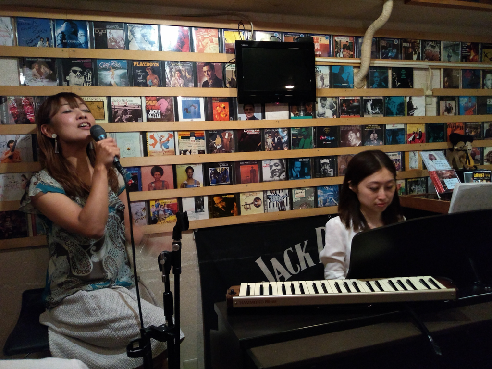

+++
title = "Paco"
author = ["Brian McCrory"]
publishDate = 2023-05-12
tags = ["clubs", "premium"]
categories = ["clubs"]
draft = false
[cover]
  image = "IMG_20181110_190247665-1024.jpeg"
  relative = true
+++

Paco is a tiny jazz bar in the central Hanzomon/Yotsuya area that features excellent food and comfortable jazz performances. Upon entering, one feels literally surrounded by jazz, encountering walls covered with jazz CDs and record covers. In this small room, the performers (often a singer plus a guitarist or pianist) will sit or stand right in front of the seated customers for two or three performance sets starting at 7:30, 8:30, and 9:30 PM. The audience area holds about 12 customers at most; at certain times for popular performers, reservations are recommended, although the gracious bar master will try to squeeze in anyone who arrives on crowded nights.

Mine-san, the owner and chef at Paco, used to be the head chef at another famous and long-running jazz bar and now runs the show here. Along with a choice of a few different meals, the Toku Set includes four dishes and is very reasonably priced. Paco also features a nice selection of non-alcoholic cocktails and delicious hand-made desserts, when available.

Paco ranks well in the category of cheery and welcoming places for at-home jazz performances. This is a great place for cozy jazz with dinner, and an early closing time allows you to return home before it gets too late.


