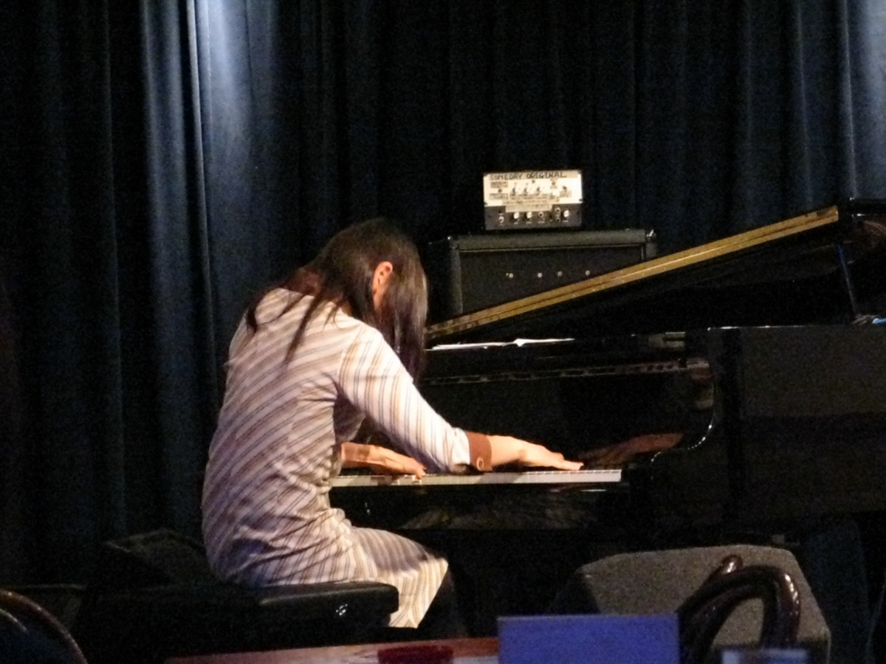
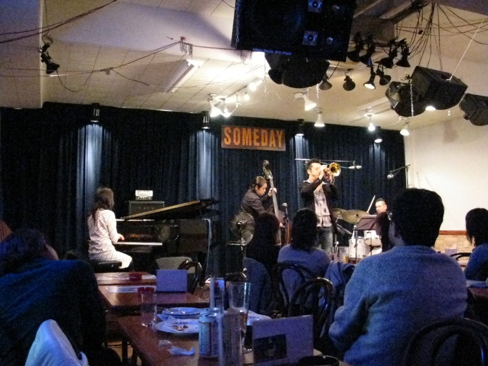

+++
title = "Someday"
author = ["Brian McCrory"]
publishDate = 2024-11-12
tags = ["clubs", "premium"]
categories = ["clubs"]
draft = false
[cover]
  image = "IMG_2354-1200.jpeg"
  relative = true
+++

The jazz bar Someday in the Shinjuku Sanchome (now in Asakusa) nightlife area offers a big stage, a wide-open seating area, and an audiophile’s setup with special custom speakers hanging from the ceiling. You get the sense that the planning for Someday has all been thought out and carefully arranged to provide a satisfying and authentic live jazz experience in an American-style spacious jazz bar setting among the typically cozier Tokyo options. In the same spirit, the kitchen at Someday provides a variety of reasonably-priced snacks and dishes featured in the English-friendly menus, including some specialty rice and meat plates that are pleasant discoveries at this type of jazz bar.

To make a night of it, if you don’t mind hurrying around, you can even double-up your jazz in one night by jazz bar-hopping (はしご, _hashigo_). Combine a visit to Someday by catching one set of two there and then heading to nearby [Polka Dots](https://www.jazzofjapan.com/archive/polka-dots) or [Pit Inn](https://www.jazzofjapan.com/archive/pit-inn) jazz clubs to catch another performance, or vice-versa. Also note that Pit Inn has daytime shows in addition to the evening, which could add a third entry to your day’s jazz plan. Just be sure to check the start times for each venue so you do not miss out on too much. _([Jazzspot J](https://www.jazzofjapan.com/archive/jazzspot-j) was another great option for jazz bar-hopping around the same neighborhood, but Jazzspot J has permanently closed.)_

One thing to remember: The name of this club, **Someday**, is short and simple but could easily be mixed up with [Sometime](https://www.jazzofjapan.com/archive/sometime) (in Kichijoji) and [Somethin’](https://www.jazzofjapan.com/archive/somethin) (in Ikebukuro). Make sure you’re headed to the right place based on location, schedule, and preference.



Also, assuming that the name _Someday_ is a reference to the popular jazz standard “Someday my Prince Will Come”, be on the lookout for discovering other possible similarly-named clubs. For example, it’s easy to imagine jazz bars named _Somewhere_ (“Somewhere Over the Rainbow”), _Someone_ (“Someone to Watch Over Me”), or _Somebody_ (“Somebody Loves Me”). Or maybe even just _Some_ (“Some Other Time”, “Some Other Spring”, “Some Other Blues”). _Some Jazz Bar_ has a nice ring to it, although that name itself could also be mistaken for _Sone Jazz Club_ (ソネ, so-ne), a famous and long-running spot in Kobe.

_Note: Someday moved from its previous Shinjuku-Sanchome location in Jan 2025. Someday is now located near Asakusa._


