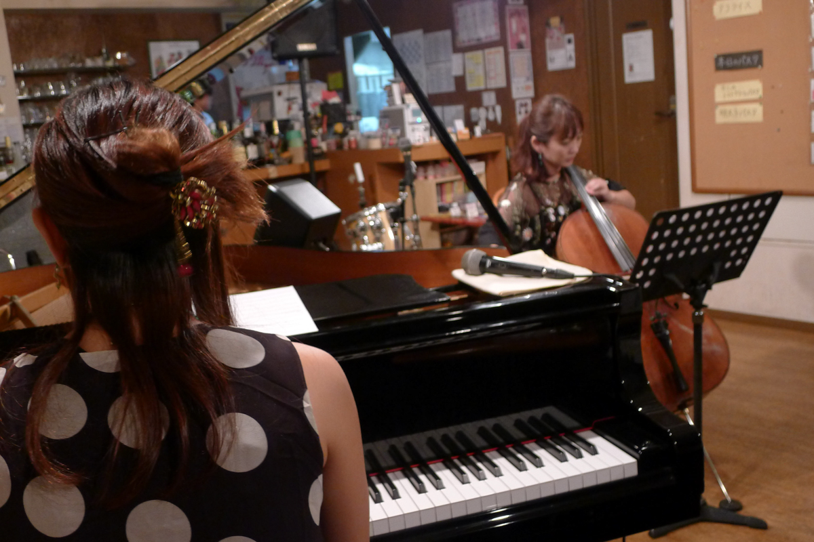

+++
title = "Sunny Side"
author = ["Brian McCrory"]
publishDate = 2025-03-18
tags = ["clubs", "premium"]
categories = ["clubs"]
draft = false
[cover]
  image = "L1270509-1200.jpeg"
  relative = true
+++

Sunny Side is a neighborhood jazz joint in Takadanobaba, Tokyo, and is a place that feels comfortably familiar whether it’s your first time, tenth time, or returning to visit after a years-long absence. At Sunny Side, jazz performances are delivered in a friendly atmosphere with home-cooked food that includes pasta dishes, fried foods, salads, and Japanese taco rice.

The live schedule here features a roster of reliable local musicians that span the gamut from up-and-coming acts to professional career musicians. In addition to their focus on creating a welcoming space for listeners and musicians to share in their love of jazz, another goal of Sunny Side is to support amateur musicians with plenty of open jazz jam sessions, workshops, and lessons that are regularly held here. Sunny Side’s website makes it easy to view the upcoming acts on the calendar organized by whether they are live performances, vocal jazz sessions, instrumental jazz jam sessions, or lessons.

Satisfied guests of Sunny Side who are likely to become repeat customers can also look forward to picking up a stamp card for member-style discounts or similar benefits, with possible extra stamps on their birthday.




























