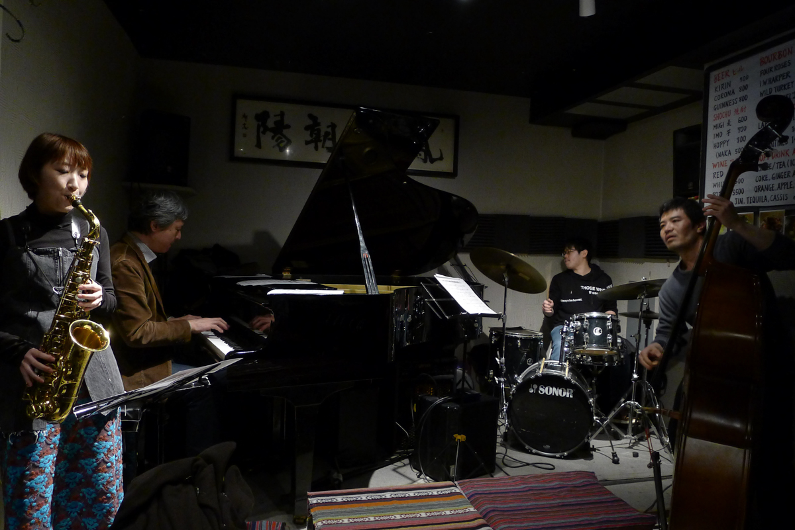
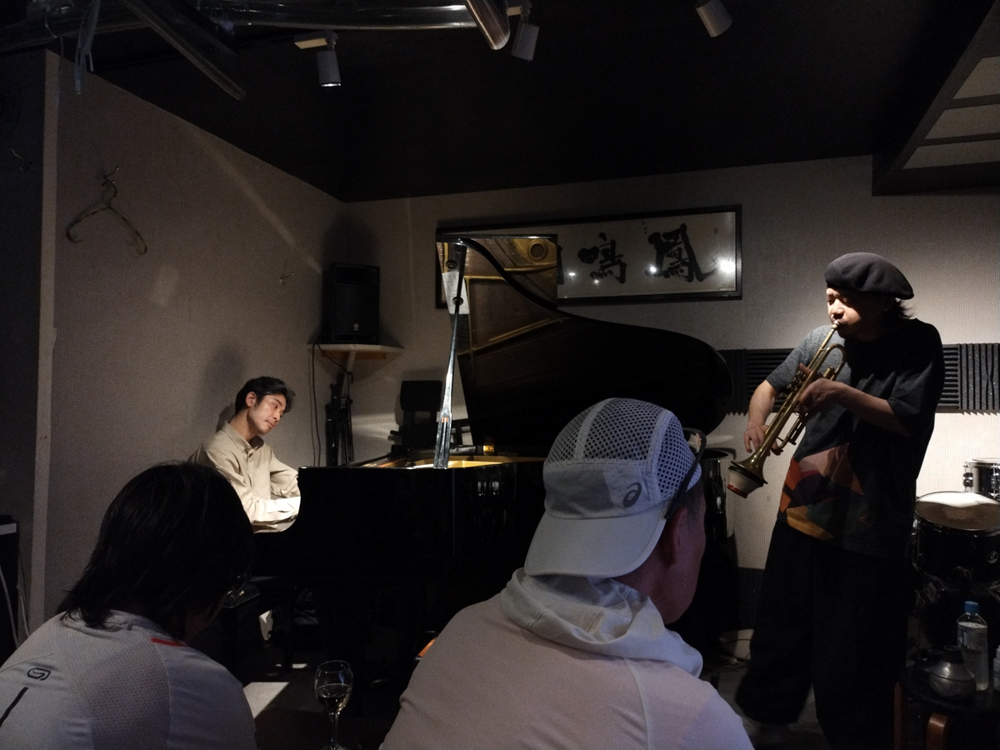

+++
title = "Thelonious"
author = ["Brian McCrory"]
publishDate = 2025-05-23
tags = ["clubs", "premium"]
categories = ["clubs"]
draft = false
[cover]
  image = "IMG_20250303_200615544-1200.jpeg"
  relative = true
+++

“The World’s Smallest Jazz Club” was a commonly mentioned nickname for the jazz club [Hot House](https://www.jazzofjapan.com/archive/hot-house) in Takadanobaba, Tokyo. But now that that classic spot has closed, this honorable title could be given to the spot named Thelonious, another classic Tokyo haven that is a revered yet extremely down-to-earth jazz bar in Higashi-Nakano. (Still, there are many other possible contenders for this “World’s Smallest” title, such as [P’s Bar](https://www.jazzofjapan.com/archive/ps-bar), [Polka Dots](https://www.jazzofjapan.com/archive/polka-dots/), and others...)

With its plain setting and simple furnishings, Thelonious is a soulful and humble listening room. It’s tiny, but not cramped, a perfectly minimalistic place for focused audiences who are there for hot jazz in a friendly and uncomplicated setting.

The bar has changed locations twice in the same Higashi-Nakano neighborhood and close to Higashi-Nakano station. The photos above (and some further below) were taken at Thelonious’s current location, and notes and photos from the two previous locations are also included below.





## Thelonious’s Current Location {#thelonious-s-current-location}

Today, Thelonious’s third and current location occupies a street-level shop whose main room is essentially a small square area for the musicians’ stage and audience seats. Half of the room is taken up by the slightly raised stage where the night’s musicians gather closely in front of the grand piano and the drum set. Facing this are two rows of seats for listeners, with modest stools, benches, and small, light tables scattered around. Navigating the tight quarters may require some care to avoid bumping drinks or knocking over the low tables. Next to this is the tiny bar area, with a bathroom and kitchen in the back.



The menu contains home-cooked dishes, a few based on Senegal cooking with sauces similar to Japanese curry but with a more exotic taste. Lamb saute, green curry, a few pasta dishes, quick snacks, and a variety of alcohol are also on the menu. In summer, the menu includes kakigori (shaved ice with syrup), popular with many customers (including discerning lunchtime regulars), and anyone who loves a cold treat in Tokyo’s hot and humid season.

Thelonious’s owner Toshiko-san is a warm person to laugh and talk with, comfortable with and friendly to foreigners. In addition to her separate day job and running the bar at night, she is also a part-time jazz singer and occasionally takes the stage at Thelonious and other local jazz clubs. But, ever the supportive patron of Japan’s jazz arts, Toshiko-san runs this jazz spot herself and puts her all into it. She’s also sometimes joined by her daughter at Thelonious, forming a team with an incredibly warm, best-friends dynamic.

Big congratulations are also due Toshiko-san and Thelonious, this year celebrating Thelonious’s 20-year anniversary in May 2025. It’s rumored that customers may be treated to one free drink each day of this anniversary month. The photos at the top of this article (and more at the bottom) were all taken at Thelonious’s current location in early 2025.





## Thelonious’s First Location {#thelonious-s-first-location}

The first location was very cozy, with just enough room near the end of the bar for a few musicians to perform at a time. Thelonious opened in 2005 and operated in this location for three years. Two puppies were also often found to be playing inside the bar, happily exploring and greeting customers while the jazz music and drinks flowed.





## Thelonious’s Second Location {#thelonious-s-second-location}

After the first three years, Thelonious moved to a second location nearby, operating there for roughly eleven years. This second location occupied a basement-level space right across the street from the Higashi-Nakano train station. The space was separated into two rooms, basically a front bar/lounge area and a back room for live jazz performances and jam sessions. This back room held soft couch-style seats and small tables next to the stage area, with more chairs and seats extending back into a hallway that bridged the front and back rooms. Approximately four to six listeners in the backroom jazz area would have the best (and loudest) spots, right up front with the musicians, and the remaining guests would fill out the seats further out into the hallway. It was here where hundreds of jazz performances and jam sessions were held, helping to bring Thelonious into its own as a highly appreciated jazz spot regularly supported by musicians and fans.


















































