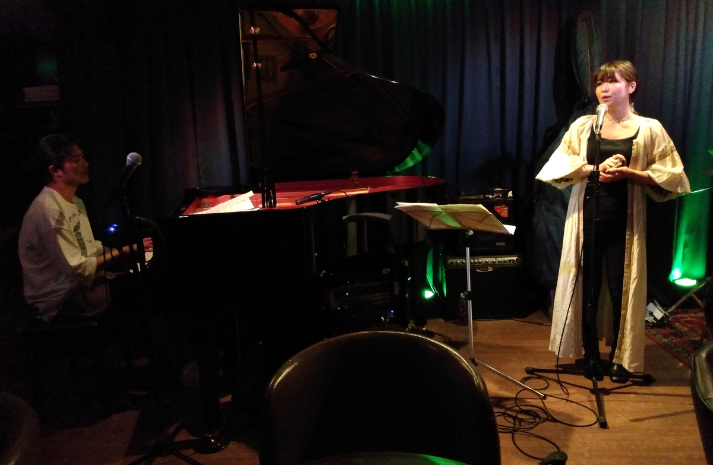
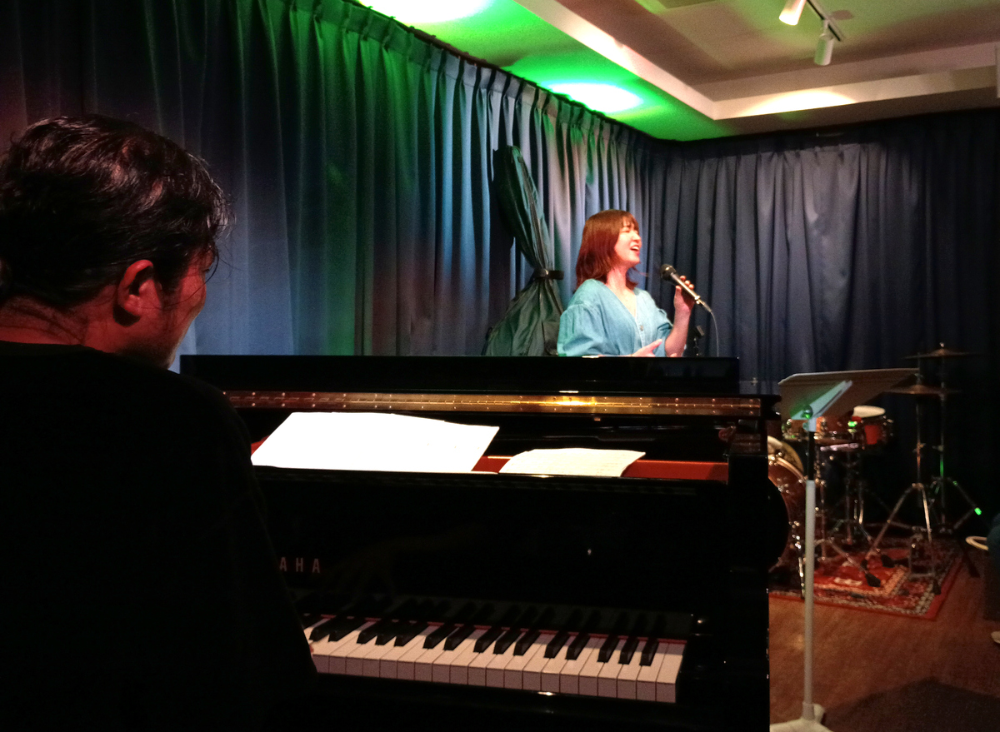

+++
title = "Velera"
author = ["Brian McCrory"]
publishDate = 2026-05-28
tags = ["clubs", "premium"]
categories = ["clubs"]
draft = false
[cover]
  image = "IMG_20190613_210528443_HDRx-1200.jpeg"
  relative = true
+++

The Tokyo jazz club Velera features live jazz in a calm, cool room hiding amid the energetic Akasaka-mitsuke business district. Guests at this hidden music refuge are able to relax at several small tables and padded seats that face the musicians, who are bathed in calming color-changing lights and of a purplish-blue curtain. Considerate of providing a safe, comfortable environment, guests are encouraged to accept a hand-sanitizing spritz upon entering, and there are also bottles of cleaning gel available at the tables.

The jazz calendar features a recurring selection of popular local artists, young up-and-comers, occasional tourist artists from overseas, and even open jam sessions where owner Kotomi Sato may join in on the drums. As a musician herself, Kotomi-san has a keen ear and fine awareness of how to put together a small jazz room. Here, the music is clear, and the atmosphere is immersive. The front bar area often has spectacular live jazz videos playing as background ambience between live sets. On the back wall is a classic portrait of jazz trumpeter Roy Hargrove, whose jazz concert was the first live event Kotomi-san experienced, and it was one that moved her deeply and remained fixed in her memory. As a tribute, she took the name of her jazz venue from the title of one of Hargrove’s original songs.

As for the stage area in this small-sized jazz room, half of the floor space holds a grand piano, upright bass, and drum set. Any vocalists or front players will take the space in the middle, and (depending on the night’s arrangement), one row of tables, chairs, and couch seats face the musicians from the back wall and bar area. There’s no elevated staged, so the musicians are at the same level as the audience. With one row of tables and seats that wrap around the stage area, there are only a few places where seats are in front of each other, so most views are straight-on, although popular events may draw a crowd such and people may likely be sitting right next to or in front of you.



Velera’s menu contains a great selection of wine, whiskey, original cocktails, beer, and snacks. While there are no large meals served here, hungrier patrons can enjoy the few larger options such homemade pizza and a mixed sausage plate.

Originally opened in 2016, Velera has been at the current Akasaka-mitsuka location since 2019 after moving from the original location in Ginza.
